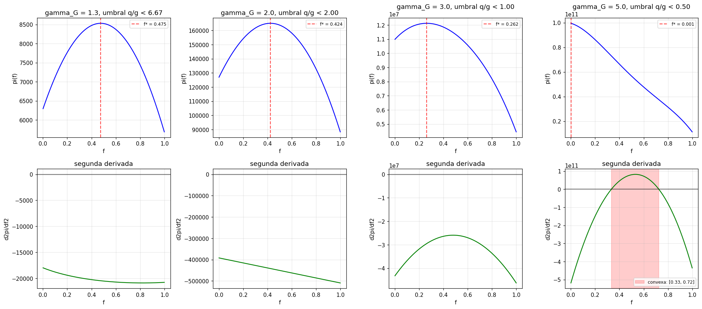

# Anexo A. Derivaciones detalladas del Capítulo 3

Este anexo recoge los cálculos paso a paso que sustentan los resultados analíticos del Capítulo 3, "Soluciones bajo racionalidad". Está organizado siguiendo el orden del cuerpo: las secciones A.1–A.3 corresponden al **óptimo del cártel** (§3.1) y contienen la primera y la segunda derivada del beneficio $\pi(f)$, junto con el análisis de concavidad y la conjetura de esquina; A.4–A.5 corresponden al **Nash homogéneo** (§3.2) y desarrollan la mejor respuesta del agente $i$ y la unicidad del equilibrio simétrico para $N$ agentes; A.6 formaliza el **límite precio-aceptante** $N \to \infty$ (§3.3); y A.7 desarrolla los **casos de borde** —saturación de batería y gas inactivo— mencionados en las hipótesis comunes del capítulo. Se reproducen las definiciones de cantidades y precios al inicio de cada bloque para que las secciones puedan leerse de forma autocontenida.

## Mapa cuerpo ↔ anexo

| Punto del cuerpo (Capítulo 3) | Se desarrolla en |
|---|---|
| §3.1 — descomposición de $d\pi/df$ en arbitraje y poder de mercado | A.2 |
| §3.1 — concavidad, condición suficiente *vs.* necesaria, esquina $f = 0$ | A.3 |
| §3.1 (hipótesis comunes) — casos de borde: saturación de batería, gas inactivo | A.7 |
| §3.2 — $(\mathrm{CPO}_i)$ del Nash homogéneo (mecánica de derivación) | A.4 |
| §3.2 — existencia y unicidad del equilibrio simétrico | A.5 |
| §3.3 — convergencia al precio-aceptante ($N \to \infty$) | A.6 |
| §3.4 — mecánica de derivación común reutilizada por el Nash heterogéneo | A.4 |
| §3.4 — concavidad de $\pi_i$ reutilizada en el caso heterogéneo | A.5 |

La derivación específica de la heterogeneidad —condición de primer orden individual, igualación de ingresos marginales, monotonía y saturación $s_i$— se recoge en el Anexo B, que remite a este anexo para la mecánica común de derivación.

## A.1. Notación y función de beneficios del cártel

Bajo las simplificaciones de §3.1 (análisis determinista con $\varepsilon = 1$, separabilidad temporal y régimen interior), el cártel concentra toda la oferta solar. Las producciones brutas **agregadas** son constantes:

$$\tilde{Q}^M = N \alpha_M c, \qquad \tilde{Q}^E = N \alpha_E c$$

Las cantidades efectivamente vendidas, las cantidades cubiertas por el gas y los precios de mercado, expresados como función de la fracción común de almacenamiento $f$, son:

$$Q^M(f) = (1 - f)\, \tilde{Q}^M, \qquad Q^E(f) = \tilde{Q}^E + \eta f\, \tilde{Q}^M$$

$$g^M(f) = D_M - Q^M(f), \qquad g^E(f) = D_E - Q^E(f)$$

$$P_M(f) = \alpha_G \bigl[g^M(f)\bigr]^{\gamma_G}, \qquad P_E(f) = \alpha_G \bigl[g^E(f)\bigr]^{\gamma_G}$$

El beneficio diario del cártel, escrito explícitamente como función de $f$, es:

$$\pi(f) = \underbrace{\alpha_G \bigl[D_M - (1-f)\tilde{Q}^M\bigr]^{\gamma_G} \cdot (1-f)\tilde{Q}^M}_{=:\, U(f)\, V(f)} \;+\; \underbrace{\alpha_G \bigl[D_E - \tilde{Q}^E - \eta f \tilde{Q}^M\bigr]^{\gamma_G} \cdot \bigl(\tilde{Q}^E + \eta f \tilde{Q}^M\bigr)}_{=:\, W(f)\, Z(f)}$$

## A.2. Primera derivada

La derivada se calcula aplicando la regla del producto a cada uno de los dos sumandos, $\pi(f) = U(f)\,V(f) + W(f)\,Z(f)$, identificando los factores como se indica arriba: $U = P_M$, $V = Q^M$, $W = P_E$, $Z = Q^E$.

### Derivada del primer sumando (mañana)

Las derivadas individuales son:

$$\frac{dV}{df} = \frac{d}{df}\bigl[(1-f)\tilde{Q}^M\bigr] = -\tilde{Q}^M$$

Para $dU/df$ se aplica la regla de la cadena. La derivada interior es $\dfrac{d}{df}\bigl[D_M - (1-f)\tilde{Q}^M\bigr] = \tilde{Q}^M$, y la exterior $\dfrac{d}{dx}\bigl[\alpha_G x^{\gamma_G}\bigr] = \alpha_G \gamma_G x^{\gamma_G - 1}$, con $x = g^M(f)$:

$$\frac{dU}{df} = \alpha_G \gamma_G \bigl[g^M(f)\bigr]^{\gamma_G - 1} \cdot \tilde{Q}^M$$

Por la regla del producto:

$$\frac{d}{df}\bigl[U V\bigr] = \alpha_G \gamma_G \tilde{Q}^M \bigl[g^M\bigr]^{\gamma_G - 1} \cdot (1-f)\tilde{Q}^M \;-\; \tilde{Q}^M \alpha_G \bigl[g^M\bigr]^{\gamma_G} = \tilde{Q}^M \cdot \Bigl\{ \alpha_G \gamma_G \cdot Q^M \bigl[g^M\bigr]^{\gamma_G - 1} - P_M \Bigr\}$$

donde se ha usado $(1-f)\tilde{Q}^M = Q^M$ y la definición de $P_M$.

### Derivada del segundo sumando (tarde)

De forma análoga, $\dfrac{dZ}{df} = \eta \tilde{Q}^M$. La derivada interior es ahora $\dfrac{d}{df}\bigl[D_E - \tilde{Q}^E - \eta f \tilde{Q}^M\bigr] = -\eta \tilde{Q}^M$, de modo que:

$$\frac{dW}{df} = \alpha_G \gamma_G \bigl[g^E\bigr]^{\gamma_G - 1} \cdot (-\eta \tilde{Q}^M) = -\alpha_G \gamma_G \eta \tilde{Q}^M \bigl[g^E\bigr]^{\gamma_G - 1}$$

Aplicando la regla del producto:

$$\frac{d}{df}\bigl[W Z\bigr] = -\alpha_G \gamma_G \eta \tilde{Q}^M \bigl[g^E\bigr]^{\gamma_G - 1} \cdot \bigl(\tilde{Q}^E + \eta f \tilde{Q}^M\bigr) \;+\; \eta \tilde{Q}^M \alpha_G \bigl[g^E\bigr]^{\gamma_G} = \tilde{Q}^M \cdot \Bigl\{ -\alpha_G \gamma_G \eta \cdot Q^E \bigl[g^E\bigr]^{\gamma_G - 1} + \eta P_E \Bigr\}$$

### Suma y forma final

Sumando ambas contribuciones y agrupando $\tilde{Q}^M$ como factor común:

$$\boxed{\,\frac{d\pi}{df} = \tilde{Q}^M \cdot \Bigl\{ \eta P_E - P_M + \alpha_G \gamma_G \bigl[\, Q^M \bigl[g^M\bigr]^{\gamma_G - 1} - \eta\, Q^E \bigl[g^E\bigr]^{\gamma_G - 1}\bigr] \Bigr\}\,}$$

que es la forma agrupada empleada en §3.1: el corchete de arbitraje temporal $\eta P_E - P_M$ y el corchete de poder de mercado. Como $\tilde{Q}^M > 0$, la condición de primer orden $d\pi/df = 0$ equivale a anular la expresión entre llaves, lo que reordenado da la (CPO) de §3.1.

## A.3. Segunda derivada y concavidad

Para verificar que la solución de la (CPO) es un máximo se calcula $d^2\pi/df^2$. En lo que sigue se omite la dependencia explícita en $f$.

### A.3.1. Derivadas de los precios y de las potencias

Por las reglas obtenidas en A.2:

$$\frac{dP_M}{df} = \alpha_G \gamma_G \bigl[g^M\bigr]^{\gamma_G - 1} \tilde{Q}^M, \qquad \frac{dP_E}{df} = -\alpha_G \gamma_G \eta \bigl[g^E\bigr]^{\gamma_G - 1} \tilde{Q}^M$$

Para las potencias inframarginales, aplicando de nuevo la regla de la cadena:

$$\frac{d}{df}\bigl[g^M\bigr]^{\gamma_G - 1} = (\gamma_G - 1)\bigl[g^M\bigr]^{\gamma_G - 2} \tilde{Q}^M, \qquad \frac{d}{df}\bigl[g^E\bigr]^{\gamma_G - 1} = -(\gamma_G - 1)\bigl[g^E\bigr]^{\gamma_G - 2} \eta \tilde{Q}^M$$

### A.3.2. Derivada de cada término inframarginal

Sea $T_M := \alpha_G \gamma_G \cdot Q^M \bigl[g^M\bigr]^{\gamma_G - 1}$. Aplicando la regla del producto y usando $dQ^M/df = -\tilde{Q}^M$:

$$\frac{dT_M}{df} = -\alpha_G \gamma_G \tilde{Q}^M \bigl[g^M\bigr]^{\gamma_G - 1} + \alpha_G \gamma_G (\gamma_G - 1)\tilde{Q}^M \cdot Q^M \bigl[g^M\bigr]^{\gamma_G - 2} = \alpha_G \gamma_G \tilde{Q}^M \bigl[g^M\bigr]^{\gamma_G - 1} \left[ \frac{(\gamma_G - 1)Q^M}{g^M} - 1 \right]$$

Análogamente, para $T_E := \alpha_G \gamma_G \eta \cdot Q^E \bigl[g^E\bigr]^{\gamma_G - 1}$, usando $dQ^E/df = \eta\tilde{Q}^M$:

$$\frac{dT_E}{df} = \alpha_G \gamma_G \eta^2 \tilde{Q}^M \bigl[g^E\bigr]^{\gamma_G - 1} \left[ 1 - \frac{(\gamma_G - 1)Q^E}{g^E} \right]$$

### A.3.3. Combinación

Recordando que $\dfrac{d\pi}{df} = \tilde{Q}^M(T_M - P_M - T_E + \eta P_E)$, se obtiene:

$$\frac{d^2\pi}{df^2} = \tilde{Q}^M \left( \frac{dT_M}{df} - \frac{dP_M}{df} - \frac{dT_E}{df} + \eta \frac{dP_E}{df} \right)$$

Sustituyendo las cuatro derivadas y agrupando los factores comunes $\alpha_G \gamma_G \bigl[g^M\bigr]^{\gamma_G - 1}$ y $\alpha_G \gamma_G \eta^2 \bigl[g^E\bigr]^{\gamma_G - 1}$:

$$\boxed{\,\frac{d^2\pi}{df^2} = (\tilde{Q}^M)^2 \alpha_G \gamma_G \left\{ \underbrace{\bigl[g^M\bigr]^{\gamma_G - 1} \left[ \frac{(\gamma_G - 1)Q^M}{g^M} - 2 \right]}_{=:\, \Theta^M} + \underbrace{\eta^2 \bigl[g^E\bigr]^{\gamma_G - 1} \left[ \frac{(\gamma_G - 1)Q^E}{g^E} - 2 \right]}_{=:\, \Theta^E} \right\}\,}$$

El $-2$ de cada corchete recoge el efecto cóncavo de la doble penalización cantidad-precio del término cruzado de la regla del producto; el sumando $(\gamma_G - 1)Q^p/g^p$ recoge la contribución convexa proporcional a la cuota del cártel sobre el gas residual del periodo $p$.

### A.3.4. Condición suficiente *vs.* necesaria

Las cantidades $\alpha_G \gamma_G \bigl[g^M\bigr]^{\gamma_G - 1}$ y $\alpha_G \gamma_G \eta^2 \bigl[g^E\bigr]^{\gamma_G - 1}$ son estrictamente positivas en el régimen interior. Una condición **suficiente** para la concavidad estricta es que cada corchete sea negativo por separado, esto es, que en ambos periodos

$$\frac{Q^p}{g^p} < \frac{2}{\gamma_G - 1}, \qquad p \in \{M, E\}.$$

Con $\gamma_G = 1{,}3$ esto exige $Q^p/g^p < 2/0{,}3 \approx 6{,}67$, cota que se cumple holgadamente: el barrido numérico de los parámetros base arroja $Q^M/g^M \le 1{,}904$ (alcanzado en $f = 0$) y $Q^E/g^E \le 1{,}386$ (alcanzado en $f = 1$), muy por debajo del umbral.

La condición es, sin embargo, **sólo suficiente**. La concavidad global no requiere $\Theta^M < 0$ y $\Theta^E < 0$ por separado, sino únicamente que su suma sea negativa, $\Theta^M + \Theta^E < 0$. Cuando un periodo viola su corchete —pongamos $\Theta^M > 0$— el otro, con $\Theta^E < 0$ suficientemente grande en valor absoluto, puede compensar y preservar $\Theta^M + \Theta^E < 0$. El límite donde se anula la concavidad es la curva en el espacio $(f, \gamma_G)$ definida por

$$\bigl[g^M\bigr]^{\gamma_G - 1} \left[ \frac{(\gamma_G - 1)Q^M}{g^M} - 2 \right] + \eta^2 \bigl[g^E\bigr]^{\gamma_G - 1} \left[ \frac{(\gamma_G - 1)Q^E}{g^E} - 2 \right] = 0,$$

y la pérdida efectiva de concavidad —existencia de un intervalo de $f$ con $d^2\pi/df^2 > 0$— sólo se produce cuando $\gamma_G$ es elevado y la cuota del cártel sobre el gas residual es suficientemente alta en al menos un periodo, de modo que el corchete positivo de ese periodo no llega a compensarse con el negativo del otro.

### A.3.5. Esquina típicamente en $f = 0$

Cuando la concavidad se pierde, el óptimo del cártel se desplaza a una esquina, y esa esquina es **típicamente $f = 0$** (no almacenar) en lugar de $f = 1$ (almacenar todo lo posible). El argumento se apoya en el signo de $d\pi/df$ evaluada en los bordes.

En $f = 0$, $Q^M = \tilde{Q}^M$ es máxima y $Q^E = \tilde{Q}^E$ mínima, de modo que $g^E$ es grande. Para $\gamma_G$ elevado, la sensibilidad del precio vespertino $\alpha_G \gamma_G \bigl[g^E\bigr]^{\gamma_G - 1}$ se dispara: aunque la cantidad inframarginal vespertina $Q^E$ sea pequeña en $f = 0$, el término de poder de mercado $-\eta\, \alpha_G \gamma_G\, Q^E \bigl[g^E\bigr]^{\gamma_G - 1}$ domina sobre el arbitraje $\eta P_E - P_M$, y el corchete completo de $d\pi/df$ se vuelve negativo:

$$\left.\frac{d\pi}{df}\right|_{f=0} \le 0 \quad \text{para } \gamma_G \text{ suficientemente alto.}$$

El cártel no quiere almacenar ni siquiera la primera unidad: hacerlo aportaría volumen vespertino, pero a costa de devaluar las unidades vespertinas inframarginales que vende a precio muy alto.

En $f = 1$, en cambio, $Q^M = 0$ y $Q^E$ es máxima, $g^E$ pequeña: el arbitraje $\eta P_E - P_M$ se ha invertido —el precio matutino ha subido tanto y el vespertino bajado tanto que ya no compensa seguir trasvasando— y de nuevo $d\pi/df\big|_{f=1} \le 0$. Con la derivada negativa en ambos extremos y una eventual región convexa intermedia, $\pi$ es esencialmente decreciente en $[0, 1]$, de modo que el máximo global se alcanza en $f = 0$, donde $\pi(0) > \pi(1)$. Económicamente, el cártel prefiere preservar el precio vespertino antes que cerrar el arbitraje, y el mismo poder de mercado que lo lleva a almacenar poco en el régimen cóncavo lo empuja a no almacenar nada cuando $\gamma_G$ es extremo.

### A.3.6. Evidencia numérica de la conjetura de esquina

La figura siguiente resuelve el experimento descrito: para cuatro valores crecientes $\gamma_G \in \{1{,}3;\, 2;\, 3;\, 5\}$, con el resto de parámetros en su configuración base de §3.5, se evalúa $\pi(f)$ y $d^2\pi/df^2$ sobre $[0, 1]$ y se localiza el óptimo.

Los hallazgos confirman el análisis de A.3.4–A.3.5:

- **$\gamma_G = 1{,}3$ y $\gamma_G = 2$** (umbrales $6{,}67$ y $2{,}0$): la condición suficiente se cumple en todo $[0, 1]$, $\pi$ es estrictamente cóncava y el óptimo es interior ($f^* = 0{,}475$ y $f^* = 0{,}424$, respectivamente).
- **$\gamma_G = 3$** (umbral $1{,}0$): la condición suficiente **se viola en la mañana** —$Q^M/g^M = 1{,}904 > 1$ en $f = 0$— y también en la tarde para $f$ alto, pero la **compensación entre periodos** preserva la concavidad global: no aparece ninguna región con $d^2\pi/df^2 > 0$ y el óptimo sigue siendo interior ($f^* = 0{,}263$). Es la ilustración directa de que la condición es sólo suficiente.
- **$\gamma_G = 5$** (umbral $0{,}5$): las violaciones son ya tan intensas que la compensación no basta. Aparece una **región convexa** en $f \in [0{,}334;\, 0{,}724]$ y el óptimo cae en la **esquina $f \approx 0$**: el cártel deja de almacenar para preservar el precio vespertino, exactamente como predice A.3.5.

En la parametrización efectivamente empleada en el TFG ($\gamma_G = 1{,}3$) el problema es estrictamente cóncavo y la (CPO) interior caracteriza el máximo global; la conjetura de esquina es relevante sólo como advertencia sobre el comportamiento del modelo bajo costes de gas muy convexos.

## A.4. Mejor respuesta del agente $i$ en el Nash homogéneo

### A.4.1. Notación

Bajo las simplificaciones de §3.2, los $N$ agentes simétricos comparten producción bruta $\tilde{q}_i^M = \alpha_M c$, $\tilde{q}_i^E = \alpha_E c$. Las cantidades vendidas dependen sólo de la decisión propia:

$$q_i^M(f_i) = (1 - f_i)\tilde{q}_i^M, \qquad q_i^E(f_i) = \tilde{q}_i^E + \eta f_i \tilde{q}_i^M$$

mientras que la oferta agregada y los precios dependen del vector completo de decisiones:

$$Q^p = \sum_{j=1}^{N} q_j^p, \qquad g^p = D_p - Q^p, \qquad P_p = \alpha_G \bigl[g^p\bigr]^{\gamma_G}, \quad p \in \{M, E\}$$

El beneficio del agente $i$, dado el resto de decisiones fijo, es $\pi_i = P_M\, q_i^M + P_E\, q_i^E$.

### A.4.2. Derivadas auxiliares respecto a $f_i$

Las derivadas individuales son inmediatas: $\partial q_i^M/\partial f_i = -\tilde{q}_i^M$ y $\partial q_i^E/\partial f_i = \eta \tilde{q}_i^M$. Como las cantidades del resto de agentes no varían con $f_i$, la oferta agregada cambia exactamente como la individual:

$$\frac{\partial Q^M}{\partial f_i} = -\tilde{q}_i^M, \qquad \frac{\partial Q^E}{\partial f_i} = \eta \tilde{q}_i^M \;\;\Longrightarrow\;\; \frac{\partial g^M}{\partial f_i} = \tilde{q}_i^M, \quad \frac{\partial g^E}{\partial f_i} = -\eta \tilde{q}_i^M$$

de modo que las derivadas de los precios son las mismas que en el caso del cártel, con $\tilde{q}_i^M$ en lugar de $\tilde{Q}^M$:

$$\frac{\partial P_M}{\partial f_i} = \alpha_G \gamma_G \bigl[g^M\bigr]^{\gamma_G - 1} \tilde{q}_i^M, \qquad \frac{\partial P_E}{\partial f_i} = -\alpha_G \gamma_G \eta \bigl[g^E\bigr]^{\gamma_G - 1} \tilde{q}_i^M$$

### A.4.3. Derivada parcial del beneficio

Aplicando la regla del producto a $\pi_i = P_M\, q_i^M + P_E\, q_i^E$ y sustituyendo las derivadas de A.4.2:

$$\frac{\partial \pi_i}{\partial f_i} = \frac{\partial P_M}{\partial f_i} q_i^M + P_M \frac{\partial q_i^M}{\partial f_i} + \frac{\partial P_E}{\partial f_i} q_i^E + P_E \frac{\partial q_i^E}{\partial f_i}$$

$$\boxed{\,\frac{\partial \pi_i}{\partial f_i} = \tilde{q}_i^M \cdot \Bigl\{ \eta P_E - P_M + \alpha_G \gamma_G \bigl[\, q_i^M \bigl[g^M\bigr]^{\gamma_G - 1} - \eta\, q_i^E \bigl[g^E\bigr]^{\gamma_G - 1}\bigr] \Bigr\}\,}$$

La única diferencia respecto al cártel (A.2) es que las cantidades inframarginales que multiplican a las pendientes son las **individuales** $q_i^M$, $q_i^E$, no las agregadas $Q^M$, $Q^E$. Esta diferencia es la que captura la atenuación del poder de mercado al pasar del cártel al juego de Nash: cada agente sólo internaliza el efecto de su decisión sobre sus propias cantidades. Anulando la expresión entre llaves —$\tilde{q}_i^M > 0$— y reordenando se obtiene la $(\mathrm{CPO}_i)$ de §3.2. Esta misma mecánica de derivación es la que reutiliza el Anexo B para el caso heterogéneo, sin más que sustituir $\tilde{q}_i^M = \alpha_M c$ por $\tilde{q}_i^M = \alpha_M c_i$.

## A.5. Hessiana y unicidad del equilibrio simétrico

### A.5.1. Concavidad estricta del beneficio en $f_i$

Para garantizar que la mejor respuesta $\mathrm{BR}_i(f_{-i})$ es única se verifica $\partial^2 \pi_i / \partial f_i^2 < 0$. El cálculo es formalmente idéntico al de A.3, con las cantidades individuales en lugar de las agregadas. Definiendo $T_M^{(i)} := \alpha_G \gamma_G\, q_i^M \bigl[g^M\bigr]^{\gamma_G - 1}$ y $T_E^{(i)} := \alpha_G \gamma_G \eta\, q_i^E \bigl[g^E\bigr]^{\gamma_G - 1}$, y procediendo como en A.3.2–A.3.3:

$$\frac{\partial^2 \pi_i}{\partial f_i^2} = (\tilde{q}_i^M)^2 \alpha_G \gamma_G \left\{ \bigl[g^M\bigr]^{\gamma_G - 1} \left[ \frac{(\gamma_G - 1)q_i^M}{g^M} - 2 \right] + \eta^2 \bigl[g^E\bigr]^{\gamma_G - 1} \left[ \frac{(\gamma_G - 1)q_i^E}{g^E} - 2 \right] \right\}$$

La función $\pi_i$ es estrictamente cóncava en $f_i$ siempre que $q_i^p/g^p < 2/(\gamma_G - 1)$ en ambos periodos. Como en el equilibrio simétrico $q_i^p = Q^p/N$, esta condición es **menos restrictiva** que la del cártel (donde la cantidad internalizada es $Q^p$) y se relaja conforme aumenta $N$: la cuña inframarginal por agente se diluye. La mejor respuesta queda así caracterizada como el único maximizador de $\pi_i$ en $[0, 1]$.

### A.5.2. Unicidad del equilibrio simétrico

Sea

$$\Phi(f) := \frac{\partial \pi_i}{\partial f_i} \bigg|_{f_1 = \cdots = f_N = f}$$

la pendiente del beneficio del agente $i$ a lo largo de la diagonal simétrica. El equilibrio de Nash simétrico $f^N$ es la raíz de $\Phi$ en $[0, 1]$; para garantizar su unicidad basta probar que $\Phi$ es estrictamente decreciente. Al moverse a lo largo de la diagonal, $f_i$ y las $N - 1$ estrategias de los rivales varían simultáneamente, de modo que por la regla de la cadena:

$$\Phi'(f) = \frac{\partial^2 \pi_i}{\partial f_i^2} + (N - 1)\,\frac{\partial^2 \pi_i}{\partial f_i\, \partial f_j}$$

donde todas las derivadas se evalúan en el punto simétrico. La diagonal $\partial^2 \pi_i/\partial f_i^2$ ya se calculó en A.5.1. Para la cruzada se observa que, al derivar respecto a $f_j$ ($j \neq i$), las cantidades propias $q_i^M$, $q_i^E$ no cambian (no dependen de $f_j$), pero sí $g^M$ y $g^E$, que lo hacen exactamente igual que respecto a $f_i$:

$$\frac{\partial g^M}{\partial f_j} = \tilde{q}_j^M, \qquad \frac{\partial g^E}{\partial f_j} = -\eta \tilde{q}_j^M$$

Por simetría $\tilde{q}_j^M = \tilde{q}_i^M = \tilde{q}^M$. Repitiendo el cálculo de A.5.1, los términos que sobreviven son los que provienen de la variación de las potencias $\bigl[g^p\bigr]^{\gamma_G - 1}$ (no los del cambio de $q_i^p$, que ahora es nulo):

$$\frac{\partial^2 \pi_i}{\partial f_i\, \partial f_j} = (\tilde{q}^M)^2 \alpha_G \gamma_G \left\{ \bigl[g^M\bigr]^{\gamma_G - 1} \left[ \frac{(\gamma_G - 1)q_i^M}{g^M} - 1 \right] + \eta^2 \bigl[g^E\bigr]^{\gamma_G - 1} \left[ \frac{(\gamma_G - 1)q_i^E}{g^E} - 1 \right] \right\}$$

(el corchete lleva $-1$ en lugar de $-2$ porque desaparece la penalización directa cantidad-precio del propio agente). Sumando la diagonal y los $N - 1$ términos cruzados:

$$\Phi'(f) = (\tilde{q}^M)^2 \alpha_G \gamma_G \left\{ \bigl[g^M\bigr]^{\gamma_G - 1} \left[ \frac{N(\gamma_G - 1)q_i^M}{g^M} - (N + 1) \right] + \eta^2 \bigl[g^E\bigr]^{\gamma_G - 1} \left[ \frac{N(\gamma_G - 1)q_i^E}{g^E} - (N + 1) \right] \right\}$$

Así, $\Phi'(f) < 0$ siempre que en ambos periodos la cantidad **individual** satisfaga

$$\frac{q_i^p}{g^p} < \frac{N + 1}{N\,(\gamma_G - 1)},$$

condición que, para $N = 30$ y $\gamma_G = 1{,}3$, exige $q_i^p/g^p < (31/30)/0{,}3 \approx 3{,}44$, holgadamente satisfecha (en simetría $q_i^p = Q^p/N \le 1{,}904/30 \approx 0{,}063$). Conforme $N \to \infty$ la cota tiende a $1/(\gamma_G - 1)$ mientras $q_i^p \to 0$, de modo que la unicidad se preserva en todo el rango de $N$. Bajo esta condición $\Phi$ es estrictamente decreciente en $[0, 1]$ y admite a lo sumo una raíz. La existencia de raíz se sigue del teorema del valor intermedio aplicado a $\Phi$, que es continua y típicamente positiva en $f = 0$ (predomina el arbitraje cuando no hay almacenamiento) y negativa en $f = 1$ (predomina el efecto cantidad). En consecuencia, el equilibrio de Nash simétrico $f^N$ existe y es único.

> *Caso $N = 2$.* Para dos agentes la fórmula se reduce a $\Phi'(f) = \partial^2\pi_i/\partial f_i^2 + \partial^2\pi_i/\partial f_i\partial f_j$ (un único término cruzado), con la condición $q_i^p/g^p < \tfrac{3}{2}\,(\gamma_G - 1)^{-1}$; coincide con la del Anexo legacy al particularizar la expresión general anterior en $N = 2$.

## A.6. Convergencia al precio-aceptante en el límite $N \to \infty$

Esta sección formaliza el resultado de §3.3: bajo una sucesión de juegos con $N$ agentes simétricos cuya capacidad agregada permanece constante, el equilibrio de Nash simétrico $f^N$ converge al óptimo del agente precio-aceptante cuando $N \to \infty$.

### A.6.1. Familia de juegos y parametrización del límite

Considérese una sucesión de juegos indexada por $N \in \mathbb{N}$, con capacidad individual escalada inversamente al número de jugadores, $c^{(N)} = C/N$, para una capacidad agregada $C > 0$ fija. Las cantidades vendidas en simetría se expresan en términos de las agregadas, que son **independientes de $N$**:

$$q_i^{p,(N)}(f) = \frac{1}{N}\, Q^p(f), \qquad Q^M(f) = (1-f)\alpha_M C, \quad Q^E(f) = \alpha_E C + \eta f \alpha_M C$$

En consecuencia, las cantidades de gas $g^p(f) = D_p - Q^p(f)$ y los precios $P_p(f) = \alpha_G \bigl[g^p(f)\bigr]^{\gamma_G}$ no dependen de $N$, mientras que las cantidades individuales decrecen como $1/N$.

### A.6.2. Reescritura de la $(\mathrm{CPO}_i)$ con el factor $1/N$ explícito

Sustituyendo $q_i^p = Q^p/N$ en la condición de primer orden del Nash simétrico, el factor $1/N$ se extrae de forma natural:

$$P_M(f^N) - \eta P_E(f^N) = \frac{\alpha_G \gamma_G}{N} \Bigl\{ Q^M(f^N)\bigl[g^M(f^N)\bigr]^{\gamma_G - 1} - \eta\, Q^E(f^N)\bigl[g^E(f^N)\bigr]^{\gamma_G - 1} \Bigr\}$$

El corchete del lado derecho es continuo en $f$ y está acotado en $[0, 1]$ (las cantidades $Q^p$, $g^p$ y sus potencias son continuas y estrictamente positivas en el régimen interior). Por tanto el lado derecho es del orden $\mathcal{O}(1/N)$ uniformemente en $f$.

### A.6.3. Convergencia del equilibrio

Sea $\{f^N\}_{N \in \mathbb{N}}$ la sucesión de equilibrios de Nash simétricos. Como $f^N \in [0, 1]$ para todo $N$, la sucesión está acotada y, por el teorema de Bolzano–Weierstrass, admite al menos una subsucesión convergente; denótese por $f^\infty$ cualquier punto de acumulación. Tomando límite en la $(\mathrm{CPO}_i)$ reescrita a lo largo de tal subsucesión, el lado derecho tiende a cero (numerador acotado, $1/N \to 0$) y el izquierdo a $P_M(f^\infty) - \eta P_E(f^\infty)$ por continuidad. Se concluye:

$$P_M(f^\infty) = \eta\, P_E(f^\infty),$$

que es exactamente la condición de arbitraje pura del agente precio-aceptante (§3.3). La función $\Delta(f) := P_M(f) - \eta P_E(f)$ es continua y estrictamente monótona en $f$ (diferencia de dos potencias estrictamente convexas con pendientes de signo opuesto), de modo que admite a lo sumo una raíz en $[0, 1]$. Si dicha raíz existe —es decir, si $\Delta$ cambia de signo en el intervalo, condición que se cumple en el escenario considerado— todos los puntos de acumulación coinciden y la sucesión completa converge:

$$f^N \;\xrightarrow{\;N \to \infty\;}\; f^*_{\text{pa}},$$

donde $f^*_{\text{pa}}$ es la fracción óptima del agente precio-aceptante. Este resultado fundamenta rigurosamente el supuesto de competencia del Capítulo 3: la hipótesis de precio-aceptante no es arbitraria, sino el comportamiento asintótico del equilibrio de Nash cuando el número de agentes simétricos tiende a infinito y la capacidad agregada se mantiene constante.

## A.7. Casos de borde

Las secciones A.1–A.6 trabajan en el **régimen interior** (batería no saturada, gas activo en ambos periodos), donde el óptimo se caracteriza por la (CPO) interior. Esta sección desarrolla las dos ramas degeneradas que §3.5 verifica numéricamente que no se activan bajo los parámetros base, pero que el modelo admite en otras parametrizaciones (almacenamiento muy generoso, demanda baja o capacidad solar elevada). Se presentan en su forma agregada para el cártel; el caso heterogéneo individual se recoge en el Anexo B.

### A.7.1. Régimen con batería saturada

La energía que el cártel deriva a la tarde es $S(f) = \eta f \tilde{Q}^M$ mientras la batería no se llene. Con capacidad de almacenamiento agregada $s_{\text{agg}}$, la batería satura cuando $\eta f \tilde{Q}^M > s_{\text{agg}}$, esto es, para fracciones por encima de la **frontera de saturación**:

$$f_{\text{borde}} = \frac{s_{\text{agg}}}{\eta\, \tilde{Q}^M}.$$

Para $f > f_{\text{borde}}$, la energía vespertina añadida queda fijada en $s_{\text{agg}}$, independiente de $f$: la cantidad vespertina vendida $Q^E = \tilde{Q}^E + s_{\text{agg}}$ y el precio $P_E$ pasan a ser constantes, $\partial Q^E/\partial f = 0$. La fracción que se siga derivando de la mañana por encima de $f_{\text{borde}}$ no llega a la tarde —se pierde por curtailment—, de modo que la cantidad matutina $Q^M = (1-f)\tilde{Q}^M$ sigue cayendo sin contrapartida vespertina. La derivada del beneficio en el régimen saturado se reduce al término matutino:

$$\left.\frac{d\pi}{df}\right|_{\text{sat}} = \frac{d}{df}\bigl[P_M Q^M\bigr] = -\tilde{Q}^M \cdot \Bigl\{ P_M - \alpha_G \gamma_G\, Q^M \bigl[g^M\bigr]^{\gamma_G - 1} \Bigr\}$$

El término entre llaves es el ingreso marginal de la oferta matutina, estrictamente positivo cuando $P_M > 0$ y la cuña inframarginal no excede al precio; por tanto $d\pi/df\big|_{\text{sat}} < 0$ en todo el régimen saturado. Las condiciones de Karush–Kuhn–Tucker del problema con la cota $f \le f_{\text{borde}}$ son entonces

$$\frac{d\pi}{df} \le 0, \qquad f^* \le f_{\text{borde}}, \qquad \frac{d\pi}{df}\cdot\bigl(f_{\text{borde}} - f^*\bigr) = 0,$$

cuya lectura es directa: si la raíz de la (CPO) interior cumple $f^*_{\text{int}} \le f_{\text{borde}}$, el óptimo es esa raíz interior; en caso contrario el óptimo se localiza en la cota, $f^* = f_{\text{borde}}$, con $d\pi/df < 0$ (el cártel querría almacenar más pero la batería lo impide). En los parámetros base, $f_{\text{borde}} = s_{\text{agg}}/(\eta\,\tilde{Q}^M) \approx 6{,}35$ queda muy fuera de $[0, 1]$ y la restricción nunca se activa (§3.6.1).

### A.7.2. Régimen con gas inactivo

El segundo borde aparece cuando la oferta solar de un periodo cubre o supera su demanda, $Q^p \ge D_p$. Como el gas no puede producir cantidades negativas, $g^p$ se ancla en cero, el precio del periodo colapsa a $P_p = \alpha_G \cdot 0^{\gamma_G} = 0$ y ese periodo deja de aportar ingresos. El beneficio pierde la contribución correspondiente y la (CPO) se modifica eliminando su término. Para el periodo vespertino —el candidato natural, pues $Q^E$ crece con $f$— una vez alcanzado $Q^E \ge D_E$ se tiene $P_E = 0$ y

$$\left.\frac{d\pi}{df}\right|_{g^E = 0} = \frac{d}{df}\bigl[P_M Q^M\bigr] = -\tilde{Q}^M \cdot \Bigl\{ P_M - \alpha_G \gamma_G\, Q^M \bigl[g^M\bigr]^{\gamma_G - 1} \Bigr\} < 0,$$

idéntica en forma a la del régimen saturado: una vez que el precio vespertino cae a cero, almacenar más reduce las ventas matutinas sin generar ingreso vespertino, de modo que el incentivo al arbitraje desaparece y el óptimo nunca empuja $Q^E$ por encima de $D_E$. Análogamente, el borde matutino $Q^M \ge D_M$ sólo podría darse con $f$ negativo y no es admisible. Con los parámetros base, cerrar el gas vespertino exigiría $f \ge 2{,}06 > 1$ (y el matutino, $f < 0$), de modo que el gas permanece activo en ambos periodos en todo $[0, 1]$ y el régimen interior es el relevante, como verifica §3.6.
