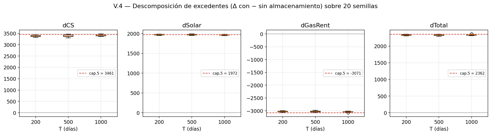
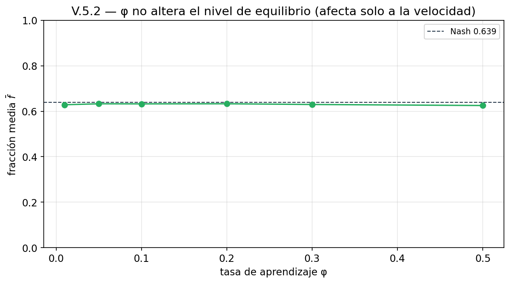

# Anexo V. Validación del modelo

Este anexo —destinado al repositorio público del proyecto, no al cuerpo del Trabajo— recoge la batería de comprobaciones con que se ha verificado que el modelo implementado en `model.py` es **reproducible**, **internamente consistente**, **fiel al modelo teórico** de los Capítulos 2–4 y que las **cifras del Capítulo 5** no son un artefacto de la semilla o del horizonte elegidos. A diferencia de los Capítulos 4 y 5, que ilustran el comportamiento del modelo con una sola corrida (semilla $0$, $T = 500$ días), aquí se barren múltiples semillas, horizontes y valores de parámetros, y se caracteriza la sensibilidad del modelo a sus ingredientes tecnológicos y de aprendizaje.

Todo el material es reproducible de una sola ejecución con `python scripts/validacion_modelo.py`, que genera los ficheros `data/validacion_*.csv` y `figures/validacion_*.png` aquí citados.[^script] El script importa de `model.py` sin modificarlo y emplea la parametrización INTERIOR y la regla de aprendizaje por defecto (z-score del beneficio realizado, actualización de la sola fracción jugada, sin decaimiento). La notación es la del cuerpo: producción bruta con tilde ($\tilde{q}_i^M$, $\tilde{q}_i^E$), energía vendida sin tilde ($q_i^M$, $q_i^E$).

[^script]: `workspace/scripts/validacion_modelo.py`. Cada sección V.x corresponde a una función homónima (`v1_reproducibilidad`, …, `v6_robustez_N`); `main()` las ejecuta en orden. Tiempo de ejecución total ≈ 3 minutos. Las cifras de este anexo se han redactado a partir de los CSV generados por ese script.

## Mapa cuerpo ↔ anexo

| Afirmación del cuerpo | Validada en |
|---|---|
| §4.3 — convergencia de $\bar f$ al Nash y reproducibilidad de las trayectorias | V.1 |
| §2.3–2.4 — identidades de producción, almacenamiento y *clearing* de mercado | V.2 |
| §4.1.3, §4.2.3 — regla de aprendizaje (z-score, solo la jugada, sin decay) | V.3 |
| §3.2 — formación de precios $P_p = \alpha_G\,[g^p]^{\gamma_G}$ | V.2, V.3 |
| Cap. 5, Tabla 5.1 — precios, gas, beneficio, ratio, coste | V.4 |
| Cap. 5, Tabla 5.2 — descomposición del excedente | V.4 |
| §5.3 — el gas total **sube** ($+2{,}4\,\%$) por la eficiencia $\eta < 1$ | V.4, V.5.1 |
| §4.1.4, §4.3 — rangos de operación de $\beta$ y $\phi$; el nivel de equilibrio es robusto | V.5 |
| §3.3, §3.6.3 — el Nash converge al precio-aceptante al crecer $N$ | V.6 |

---

## V.1. Reproducibilidad por semilla

El modelo es estocástico: la meteorología diaria ($\varepsilon$), la inicialización de las atracciones y la elección logit dependen de generadores de números aleatorios. Para que las corridas del Trabajo sean reproducibles, el constructor de `MarketModel` fija explícitamente **tanto** el generador de `random` **como** el de `numpy` (`random.seed(seed)`, `np.random.seed(seed)`). Este paso es necesario porque el argumento `seed=` de Mesa controla únicamente su propio generador interno, no el módulo `random` de Python que usan las decisiones de los agentes —una fuente silenciosa de irreproducibilidad si no se corrige—.

**Misma semilla → trayectoria idéntica.** Dos ejecuciones independientes con `seed=0` producen series de $P_M(t)$, $P_E(t)$, $\bar f(t)$ y $\bar\pi(t)$ que coinciden hasta el último bit: la diferencia máxima entre ambas es **exactamente $0$**. La reproducibilidad es, pues, completa.

**Semillas distintas → distribución asintótica común.** Repetida la simulación con las semillas $\{0, 1, \dots, 19\}$ ($T = 500$), la fracción media del régimen estacionario (últimos cien días) se distribuye estrechamente en torno a un valor común:

$$\bar f_{\text{estac}} = 0{,}632 \pm 0{,}004 \qquad (\text{mín. } 0{,}625,\ \text{máx. } 0{,}639).$$

La desviación típica entre semillas es de cuatro milésimas, un orden de magnitud por debajo de la distancia al cártel ($f^* = 0{,}475$) y dentro de un pelo del Nash teórico ($f^N = 0{,}639$). La semilla no determina *a qué* converge el sistema, solo la realización concreta del ruido en torno a ese límite común. Esto confirma cuantitativamente la afirmación de §4.3 de que la convergencia al Nash no depende de la semilla particular escogida.

Una matización metodológica honesta: la demostración *negativa* del problema —que **sin** el doble sembrado dos corridas con la misma `seed` divergirían— no puede reproducirse desde este script sin alterar `model.py`, porque la corrección está incorporada en el propio constructor. Lo que aquí se verifica es la dirección positiva (misma semilla ⇒ identidad exacta), que es la propiedad operativa relevante; la necesidad del *workaround* se documenta a nivel de código.

---

## V.2. Invariantes y *sanity checks*

Esta sección comprueba que el código respeta, en **todas** las celdas agente-día de una corrida ($N = 30$ agentes × $500$ días = $15\,000$ celdas), las identidades físicas y de mercado definidas en el Capítulo 2, sin necesidad de tocar el modelo: se opera sobre los datos que el `DataCollector` registra. Todos los contrastes se superan con **cero violaciones** y errores del orden del épsilon de coma flotante ($\sim 10^{-16}$), atribuibles al redondeo y no a discrepancias reales.

**Tabla V.1** — Invariantes verificados (corrida $N=30$, $T=500$, semilla $0$)

| Invariante | Definición | Celdas | Violaciones | Error máx. |
|---|---|---:|---:|---:|
| Almacenamiento | $\text{stored} = \min\{s,\ \eta f\, \tilde{q}_i^M\}$ | 13 444 | 0 | $2{,}2\cdot10^{-16}$ |
| Venta vespertina | $q_i^E = \tilde{q}_i^E + \text{stored}$ | 13 444 | 0 | $4{,}4\cdot10^{-16}$ |
| No-negatividad (agente) | $q_i^M,\, q_i^E,\, \text{stored} \ge 0$ | 15 000 | 0 | $0$ |
| Cota de batería | $\text{stored} \le s$ | 15 000 | 0 | $0$ |
| Conservación | $\text{stored} \le \eta f\, \tilde{q}_i^M$ | 13 444 | 0 | $0$ |
| Decisión en malla | $f_i(t) \in \{0;\,0{,}1;\,\dots;\,1\}$ | 15 000 | 0 | $0$ |
| *Clearing* mañana | umbral $D_M$ y $P_M = \alpha_G\,[g^M]^{\gamma_G}$ | 500 | 0 | $0$ |
| *Clearing* tarde | umbral $D_E$ y $P_E = \alpha_G\,[g^E]^{\gamma_G}$ | 500 | 0 | $0$ |
| No-negatividad (mercado) | $P_M, P_E, g^M, g^E \ge 0$ | 500 | 0 | $0$ |

La producción bruta $\tilde{q}_i^M$, que el colector no registra directamente, se reconstruye en las celdas con $f_i(t) < 1$ a partir de la cantidad vendida, $\tilde{q}_i^M = q_i^M / (1 - f_i)$, y de ahí $\tilde{q}_i^E = (\alpha_E/\alpha_M)\,\tilde{q}_i^M$; de las $15\,000$ celdas, $13\,444$ cumplen esa condición y se usan para los invariantes que dependen de la producción bruta. Las dos comprobaciones clave del mecanismo de almacenamiento —que lo guardado coincide con $\min\{s, \eta f \tilde{q}_i^M\}$ y que la energía vendida por la tarde es la producción bruta vespertina más lo recuperado de la batería— se cumplen exactamente, lo que verifica que **el agente ejecuta la fracción que decide**, sin deriva entre decisión y ejecución. Del lado del mercado, se reconstruye el despeje de cada periodo (si la oferta solar cubre la demanda, precio y gas nulos; si no, el gas cubre el déficit y el precio es el coste marginal del gas) y se confirma su igualdad numérica con lo registrado.

---

## V.3. Verificación cuerpo ↔ código (trazabilidad)

Esta sección establece la correspondencia entre los símbolos del modelo teórico y las variables del código, y verifica de forma **ejecutable** que la regla de aprendizaje implementada es la descrita en §4.2.3.

**Tabla V.2** — Correspondencia parámetro del cuerpo ↔ variable de `model.py`

| Cuerpo | Símbolo | Variable Python | Valor INTERIOR |
|---|---|---|---|
| Demanda mañana / tarde | $D_M,\ D_E$ | `DEMAND_M`, `DEMAND_E` | $80,\ 120$ |
| Capacidad solar | $c$ | `CAP_LOW`, `CAP_HIGH` | $2{,}5$ |
| Capacidad de batería | $s$ | `STOR_CAP_LOW/HIGH` | $10$ |
| Eficiencia | $\eta$ | `ETA_LOW`, `ETA_HIGH` | $0{,}9$ |
| Tasa de aprendizaje | $\phi_i$ | `PHI_LOW`, `PHI_HIGH` | $\mathcal{U}[0{,}05;\,0{,}3]$ |
| Exploración | $\beta_i$ | `BETA_LOW`, `BETA_HIGH` | $\mathcal{U}[2;\,3]$ |
| Granularidad | $\Delta$ | $1/$`STORAGE_GRAN` | $0{,}1$ |
| Coste del gas | $\alpha_G,\ \gamma_G$ | `ALPHA_G`, `GAMMA_G` | $0{,}5;\ 1{,}3$ |
| Reparto mañana/tarde | $\alpha_M,\ \alpha_E$ | `ALPHA_M`, `ALPHA_E` | $0{,}7;\ 0{,}3$ |

**Tabla V.3** — Correspondencia ecuación del cuerpo ↔ bloque de `model.py`

| Elemento del cuerpo | Ecuación | Código |
|---|---|---|
| Producción bruta (§2.3) | $\tilde{q}_i^M = \alpha_M c\,\varepsilon,\ \tilde{q}_i^E = \alpha_E c\,\varepsilon$ | `produce_and_decide` |
| Almacenamiento (§2.4) | $\text{stored} = \min\{s, \eta f\, \tilde{q}_i^M\}$ | `produce_and_decide` |
| Decisión logit (§4.1.2) | softmax$(\beta_i A_i)$ | `stable_softmax` |
| Contrafactual (§4.1.3) | $\pi_i(f,t)$ a precios fijos | bucle `pi_all` en `update_learning` |
| Señal z-score (§4.2.3) | $z_i = (\pi_i - \bar\pi_i)/\sigma_i$ | `update_learning` |
| Actualización (§4.2.3) | EMA solo en $f_i(t)$, resto intacto | `update_learning` |
| *Clearing* (§3.2) | $P_p = \alpha_G\,[g^p]^{\gamma_G}$ | `step_day` |

**Comprobación ejecutable de la regla.** Para no quedarse en la correspondencia declarativa, el script aísla un paso de actualización (un agente, un día) y **reproduce a mano** la fórmula de §4.2.3 a partir de los precios del día y de la atracción previa del agente, comparándola con el estado interno resultante del modelo. Los tres contrastes son exactos:

- atracción de la fracción jugada, valor esperado *vs.* observado: diferencia $= 0$;
- atracciones de las fracciones **no** jugadas: variación máxima $= 0$ (memoria persistente, sin decaimiento);
- contrafactual evaluado en la fracción jugada *vs.* beneficio realizado: diferencia $= 0$ (coherencia entre $\pi_i(f_i(t),t)$ y $\pi_i(t)$).

Queda así verificado, y no solo afirmado, que el código actualiza **únicamente** la atracción de la fracción jugada con el z-score del beneficio realizado y deja **intactas** las demás, tal como prescribe la regla elegida.

---

## V.4. Robustez de las cifras del Capítulo 5

El Capítulo 5 reporta sus cifras con una sola corrida (semilla $0$, $T = 500$). Para descartar que sean un artefacto de esa elección, se reconstruye la malla completa de **20 semillas** $\times$ **3 horizontes** $\{200, 500, 1000\}$, en los escenarios base y con almacenamiento, recomputando todas las magnitudes de las Tablas 5.1 y 5.2 con la misma metodología (medias de los últimos cien días; ratio como media de cocientes diarios; descomposición del excedente con la renta del gas $c_G(q)q - C_G(q)$).

**Tabla V.4** — Cifras del Capítulo 5 frente a la distribución sobre 20 semillas ($T = 500$)

| Magnitud | Cap. 5 (semilla 0) | Media ± desv. típ. (20 semillas) | ¿En $\pm 2\sigma$? |
|---|---:|---:|:---:|
| Fracción media $\bar f$ | $0{,}633$ | $0{,}632 \pm 0{,}004$ | ✓ |
| Ratio $P_M/P_E$ | $0{,}874$ | $0{,}872 \pm 0{,}007$ | ✓ |
| Beneficio medio $\bar\pi$ | $275{,}19$ | $275{,}15 \pm 0{,}42$ | ✓ |
| Gas mañana $\bar G_M$ | $60{,}68$ | $60{,}68 \pm 0{,}23$ | ✓ |
| Gas tarde $\bar G_E$ | $67{,}48$ | $67{,}66 \pm 0{,}20$ | ✓ |
| Gas total | $128{,}17$ | $128{,}35 \pm 0{,}13$ | ✓ |
| Δ gas total (%) | $+2{,}4$ | $+2{,}66 \pm 0{,}15$ | ✓ |
| Δ coste de gas (%) | $-27{,}1$ | $-27{,}07 \pm 0{,}20$ | ✓ |
| Δ excedente consumidor | $+3\,461$ | $+3\,390 \pm 45$ | ✓ |
| Δ excedente solar | $+1\,972$ | $+1\,971 \pm 12$ | ✓ |
| Δ renta del gas | $-3\,071$ | $-3\,030 \pm 25$ | ✓ |
| Δ excedente total | $+2\,362$ | $+2\,331 \pm 19$ | ✓ |

Todas las cifras del Capítulo 5 caen dentro de la banda de $\pm 2\sigma$ de la distribución a $T = 500$, y los **signos económicamente relevantes son universales**: en las $20$ semillas, sin excepción, el gas total sube ($+2{,}66 \pm 0{,}15\,\%$, siempre positivo), el coste de gas baja, el consumidor y el solar ganan, el productor de gas pierde y el excedente total mejora. Las conclusiones cualitativas del capítulo —cierre del arbitraje, redistribución (no reducción) del gas, ganancia neta de eficiencia, reparto del excedente— son por tanto robustas a la semilla. Las magnitudes de mercado (precios, fracción, beneficio, gas por periodo) reproducen las del capítulo a menos de una desviación típica.

**Una observación crítica, en honor a la precisión.** Conviene no sobrevender la coincidencia. Aunque todas las cifras están dentro de $\pm 2\sigma$ a $T = 500$, la semilla $0$ resulta ser un **sorteo levemente favorable para la descomposición del excedente**: sus tres componentes monetarias se sitúan en torno a $1{,}6$ desviaciones típicas del lado generoso de la distribución —el excedente del consumidor ($3\,461$ frente a la media $3\,390$), la pérdida del gas ($-3\,071$ frente a $-3\,030$) y el excedente total ($2\,362$ frente a $2\,331$)—. De hecho, con los horizontes $T = 200$ y $T = 1000$, donde la dispersión entre semillas es algo menor, esas mismas cifras de la semilla $0$ quedan justo **fuera** de la banda de $\pm 2\sigma$. El sesgo es pequeño en términos absolutos (del orden del $1$–$3\,\%$ sobre cada componente) y no altera ninguna conclusión, pero existe. En sentido opuesto, el $+2{,}4\,\%$ de gas total que titula §5.3 queda algo por **debajo** del valor central robusto ($+2{,}66\,\%$): el capítulo, si acaso, *subestima* levemente el exceso de gas.

No procede rehacer el Capítulo 5 —sus cifras son correctas para la semilla declarada y están dentro de la variación muestral— ni tampoco intervenir su texto: la salvedad queda **registrada en este anexo**, que es su lugar natural. La Tabla V.4 ofrece, para quien quiera la magnitud de la incertidumbre muestral, la media y la desviación típica sobre $20$ semillas de cada cifra del capítulo; el cuerpo conserva su trazabilidad cifra a cifra (semilla $0$) sin añadidos.

---

## V.5. Sensibilidad a parámetros

Esta sección caracteriza cómo responden los resultados a los tres parámetros centrales —la eficiencia de la batería $\eta$, la tasa de aprendizaje $\phi$ y la exploración $\beta$—, rehaciendo desde cero, con la **regla de aprendizaje elegida**, el análisis que el material antiguo planteaba con una regla distinta. Metodología: en cada barrido se fija el parámetro estudiado de forma **homogénea** para todos los agentes (los demás se mantienen en su rango por defecto), con $10$ semillas por valor y $T = 500$. Las conclusiones de robustez que siguen deben entenderse referidas a un **rango amplio pero acotado de valores plausibles**, no a valores arbitrarios: como muestra V.5.3, llevado a extremos el modelo sí cambia de régimen.

### V.5.1. Eficiencia de la batería $\eta$

A medida que la batería es más eficiente, más energía matutina llega a la tarde y menos gas se necesita: el gas total decrece de forma monótona y casi lineal, de $\bar G \approx 133{,}9$ en $\eta = 0{,}70$ a $\approx 125{,}0$ en $\eta = 1{,}00$. El resultado clave es la **prueba de consistencia con §5.3**: el exceso de gas total respecto al escenario base —ese $+2{,}4\,\%$ que el capítulo atribuye enteramente a la pérdida $\eta < 1$— **se desvanece exactamente cuando $\eta = 1$**:

| $\eta$ | $0{,}70$ | $0{,}80$ | $0{,}90$ | $0{,}95$ | $1{,}00$ |
|---|---:|---:|---:|---:|---:|
| Δ gas total vs base (%) | $+7{,}1$ | $+5{,}1$ | $+2{,}6$ | $+1{,}3$ | $-0{,}05$ |

En $\eta = 1$ el exceso es de cinco centésimas de punto, indistinguible de cero. Esto confirma, de forma cuantitativa e independiente, el mecanismo que el Capítulo 5 propone como explicación: el aumento del gas total **no** es un efecto del almacenamiento *per se*, sino de la energía que se pierde en cada ciclo de carga-descarga; sin pérdidas, almacenar no consume gas adicional. La fracción de equilibrio, por su parte, sube suavemente con $\eta$ (de $0{,}57$ a $0{,}65$), porque una batería más eficiente hace el arbitraje más rentable.

### V.5.2. Tasa de aprendizaje $\phi$

Variando $\phi$ en todo su rango plausible $\{0{,}01;\dots;0{,}50\}$, la fracción media de equilibrio permanece **prácticamente inalterada**, entre $0{,}625$ y $0{,}633$ (un rango de ocho milésimas), y el beneficio medio se mantiene en $\approx 275$. Lo que sí cambia con $\phi$ es la **textura** del aprendizaje, no su destino: la entropía de la softmax desciende de $0{,}96$ ($\phi = 0{,}01$) a $0{,}75$ ($\phi = 0{,}50$), reflejando que un agente más reactivo concentra antes su decisión. Esto valida la afirmación de que el nivel de equilibrio está fijado por la estructura del mercado, no por la velocidad a la que los agentes aprenden: $\phi$ gobierna el transitorio, no el punto de llegada.

### V.5.3. Exploración $\beta$

Este barrido ofrece el **contraste más informativo con el material antiguo**. Con la regla descartada, la fracción media trepaba fuertemente con $\beta$ (de $\approx 0{,}69$ con $\beta = 0{,}5$ hasta $\approx 0{,}97$ con $\beta = 10$): a más explotación, los agentes se pegaban a la esquina $f = 1$. Con la **regla elegida**, en cambio, la fracción media apenas se mueve en todo el rango explorado —de $0{,}598$ ($\beta = 0{,}5$) a $0{,}642$ ($\beta = 50$), un rango de **menos de cinco centésimas**, frente a las casi treinta de la regla antigua—, y nunca se acerca a la esquina:

| $\beta$ | $0{,}5$ | $1{,}0$ | $2{,}0$ | $4{,}0$ | $10$ | $20$ | $50$ |
|---|---:|---:|---:|---:|---:|---:|---:|
| $\bar f$ | $0{,}598$ | $0{,}618$ | $0{,}629$ | $0{,}636$ | $0{,}638$ | $0{,}641$ | $0{,}642$ |
| gap beneficio (%) | $1{,}09$ | $0{,}43$ | $0{,}09$ | $-0{,}06$ | $-0{,}04$ | $-0{,}11$ | $-0{,}14$ |
| entropía | $0{,}977$ | $0{,}954$ | $0{,}896$ | $0{,}751$ | $0{,}386$ | $0{,}090$ | $0{,}009$ |

Que aumentar la explotación **no** empuje la fracción hacia la esquina es precisamente la propiedad que distingue a la regla elegida (§4.2.3): como la preferencia que el agente forma es genuinamente interior —y no un promedio de elecciones de esquina—, afinar la softmax la concentra *sobre esa preferencia interior*, no sobre $f = 1$. En el rango de operación $\beta \in [2, 3]$ la fracción se asienta en $\approx 0{,}63$ con un gap de beneficio inferior a una décima de punto porcentual. El barrido valida, así, una de las tesis centrales del Capítulo 4.

Ahora bien, esa robustez es **del nivel, no de la exploración, y vale en un rango amplio pero acotado**. La tercera fila de la tabla lo deja claro: la entropía de la softmax se desploma al subir $\beta$, de $0{,}98$ (elección casi uniforme) a $0{,}009$ (elección casi determinista) en $\beta = 50$. A $\beta$ muy alto sobreviene, pues, **fijación**: cada agente concentra toda su probabilidad en una única fracción y desaparece la exploración residual que §4.2.3 identifica como un rasgo de diseño (la que sostiene la robustez ante cambios del entorno y refleja la planitud del paisaje de beneficios). La diferencia decisiva con la regla antigua es *dónde* se fija: aquí, sobre una fracción **interior** ($\bar f \approx 0{,}64$, donde su preferencia tiene la moda), no sobre la esquina $f = 1$. De modo que la afirmación correcta no es que el modelo sea robusto a $\beta$ sin más, sino que **dentro del rango plausible** (digamos $\beta \lesssim 5$) el nivel de equilibrio es insensible a $\beta$ y la exploración se conserva; empujado más allá, el nivel se mantiene pero el aprendizaje degenera en elección fija.

---

## V.6. Robustez agregada: el papel de $N$

La última prueba conecta la simulación con la estática comparativa del Capítulo 3. El barrido recorre $N \in \{2, 5, 10, 20, 30, 50\}$ **manteniendo constante la oferta solar agregada** $N\cdot c = 75$ (es decir, $c = 75/N$), de modo que la única diferencia entre configuraciones es el grado de competencia, no el volumen de energía disponible. Para preservar el régimen interior de batería holgada en todo el rango —y no confundir el efecto del poder de mercado con una saturación de la batería—, la capacidad de almacenamiento se escala en la misma proporción que la productiva ($s = 4c$, manteniendo $s/c = 10/2{,}5$); con $s = 10$ fijo, a $N$ pequeño ($c$ grande) la batería saturaría y contaminaría el experimento.[^satura]

[^satura]: Con $N = 2$ se tendría $c = 37{,}5$ y, para una fracción de $\approx 0{,}6$, una carga $\eta f \tilde{q}^M \approx 14 > s = 10$: la batería saturaría, imponiendo un techo a $f$ ajeno al poder de mercado. Escalar $s$ con $c$ lo evita y deja el régimen comparable al del cuerpo.

El resultado reproduce limpiamente, **por aprendizaje**, la predicción analítica de §3.3 y §3.6.3: al crecer $N$, la cuña de poder de mercado por agente (que decae como $1/N$) se diluye y el sistema se acerca al límite precio-aceptante.

**Tabla V.5** — Equilibrio aprendido en función de $N$ (oferta agregada constante $N\cdot c = 75$)

| $N$ | $2$ | $5$ | $10$ | $20$ | $30$ | $50$ |
|---|---:|---:|---:|---:|---:|---:|
| $\bar f$ | $0{,}562$ | $0{,}607$ | $0{,}621$ | $0{,}629$ | $0{,}631$ | $0{,}635$ |
| $P_M/P_E$ | $0{,}774$ | $0{,}838$ | $0{,}858$ | $0{,}868$ | $0{,}870$ | $0{,}877$ |

Con pocos agentes, cada uno internaliza que almacenar más deprime su propio ingreso vespertino, frena el arbitraje y deja el ratio de precios lejos de $\eta$ ($0{,}77$ con $N = 2$): es el comportamiento próximo al cártel. A medida que $N$ crece, esa contención se desvanece, la fracción sube hacia el Nash y el ratio asciende monótonamente hacia el umbral de no-arbitraje del precio-aceptante ($P_M/P_E \to \eta = 0{,}90$). En $N = 30$ —el valor del Trabajo— se obtiene $\bar f = 0{,}631$ y un ratio $0{,}870$, coherentes con las cifras del Capítulo 5 ($0{,}633$ y $0{,}874$) y con el Nash teórico ($0{,}639$, $0{,}880$). La convergencia al límite competitivo es lenta —incluso en $N = 50$ el ratio ($0{,}877$) no ha alcanzado $\eta$—, lo que ilustra que la cuña $\sim 1/N$ se cierra despacio, en consonancia con que el Nash de $N = 30$ esté ya cerca del precio-aceptante pero no sobre él.

### Síntesis: qué es robusto y qué es sensible

| Resultado | Veredicto | Evidencia |
|---|---|---|
| Convergencia de $\bar f$ al Nash ($\approx 0{,}63$) | **Robusto** a semilla, horizonte, $\phi$ y $\beta$ (en rango amplio pero acotado) | V.1, V.4, V.5.2–3 |
| Cierre del arbitraje (ratio $\to \approx \eta$) | **Robusto**; depende de $N$ de forma predecible | V.4, V.6 |
| Ganancia de eficiencia en coste ($-27\,\%$) y su reparto (signos) | **Robusto** (signos en el $100\,\%$ de las semillas) | V.4 |
| El gas total **sube** ($+2{,}6\,\%$) por $\eta < 1$ | **Robusto**; se anula en $\eta = 1$ (mecanismo confirmado) | V.4, V.5.1 |
| Cifras *exactas* del excedente (euros) de la semilla 0 | **Sensible** a la semilla ($\sim 1{,}6\sigma$ del lado favorable) | V.4 |
| Exploración residual (entropía $>0$) | **Sensible** fuera del rango plausible: colapsa a $\beta$ extremo (fijación interior) | V.5.3 |
| Nivel de equilibrio | Fijado por la estructura del mercado ($N$, $\eta$), no por el aprendizaje ($\phi$, $\beta$) | V.5, V.6 |

---

## Reporte de validación

**Afirmaciones del Trabajo que este anexo respalda:**

1. **Reproducibilidad (§4.3).** Misma semilla ⇒ trayectoria idéntica; la convergencia de $\bar f$ al Nash ($0{,}632 \pm 0{,}004$ sobre 20 semillas) es independiente de la semilla.
2. **Fidelidad del código (Caps. 2–4).** Cero violaciones de los nueve invariantes físicos y de mercado sobre $15\,000$ celdas; la regla de aprendizaje §4.2.3 se reproduce a mano con diferencia nula.
3. **Cifras de mercado del Cap. 5 (Tabla 5.1).** Precios, fracción, beneficio y gas por periodo reproducidos a menos de $1\sigma$ sobre 20 semillas y robustos al horizonte.
4. **Conclusiones de bienestar del Cap. 5 (Tabla 5.2).** Los signos del reparto (consumidor +, solar +, gas −, sistema +) se mantienen en el $100\,\%$ de las semillas.
5. **Mecanismo del gas (§5.3).** El aumento del gas total es íntegramente atribuible a $\eta < 1$: se anula en $\eta = 1$ (V.5.1).
6. **Robustez del nivel de equilibrio (§4.3).** En un rango amplio pero acotado de valores plausibles, el nivel es insensible a $\phi$ y a $\beta$ y la regla elegida no persigue la esquina (V.5.3).
7. **Estática comparativa en $N$ (§3.3, §3.6.3).** El aprendizaje reproduce la convergencia Nash → precio-aceptante al crecer $N$ (V.6).

**Lo que este anexo matiza y no puede sostener sin reserva:**

- Las **cifras monetarias exactas** de la descomposición del excedente (Tabla 5.2) corresponden a una semilla que está $\sim 1{,}6\sigma$ del lado favorable de su distribución: a horizontes distintos de $500$ quedan fuera de $\pm 2\sigma$. El $+2{,}4\,\%$ de gas total de §5.3, simétricamente, *subestima* levemente el valor robusto ($+2{,}66\,\%$). Esta salvedad se deja **documentada en este anexo** (Tabla V.4 da las desviaciones típicas sobre $20$ semillas); el cuerpo del Trabajo no se modifica.
- La **robustez a los parámetros** vale en un **rango amplio pero acotado** de valores plausibles. Fuera de él el modelo cambia de régimen: a $\beta$ extremo la exploración colapsa (entropía $\to 0$) y el aprendizaje degenera en elección fija —fijación sobre una fracción interior, no sobre la esquina— (V.5.3). El barrido se ha hecho además **un parámetro cada vez**; no se exploran interacciones entre $\eta$, $\phi$, $\beta$ y $N$.
- La **demostración negativa** del bug de semilla de Mesa (que sin el doble sembrado las corridas divergirían) no se prueba aquí, por estar la corrección incorporada al constructor; se documenta a nivel de código.
