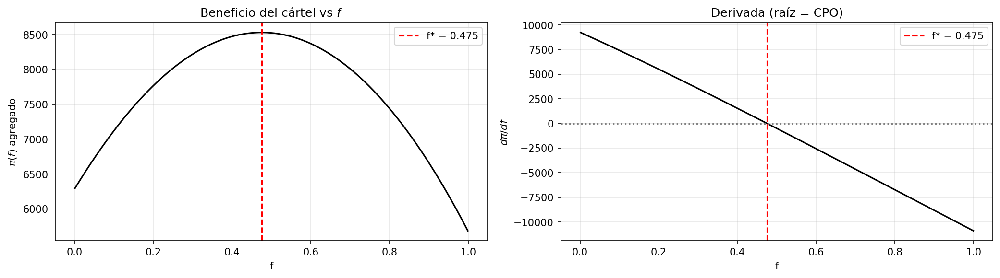
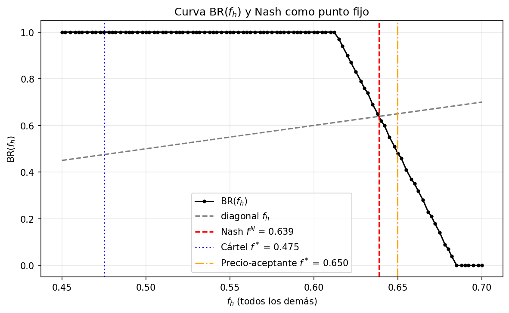
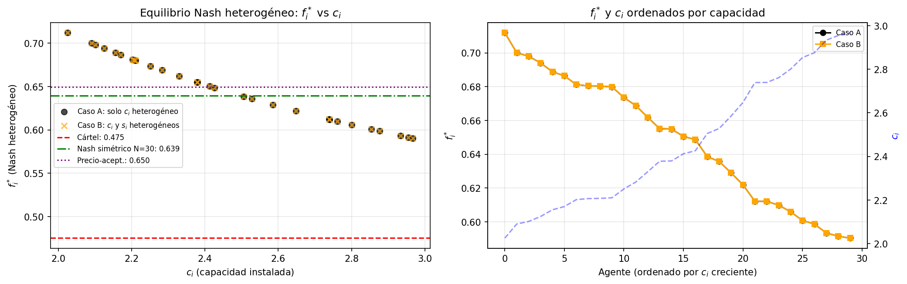

# Capítulo 3. Soluciones bajo racionalidad

El Capítulo 2 dejó deliberadamente sin definir la regla por la que cada productor solar elige su fracción de almacenamiento $f_i(t)$. Este capítulo construye el referente teórico contra el que se evaluará, en el Capítulo 4, el modelo de aprendizaje adaptativo: el conjunto de soluciones que emergerían si los agentes resolvieran su problema de optimización con racionalidad estratégica plena.

El análisis se desarrolla en cuatro niveles, ordenados por intensidad de internalización del impacto de las decisiones sobre los precios. Primero (§3.1) se estudia el **óptimo del cártel**, equivalente al de un agente representativo que concentrase toda la oferta solar e internalizase por completo el efecto de sus decisiones sobre los precios. A continuación (§3.2) se introduce la interacción estratégica entre $N$ agentes simétricos como un juego de **Nash homogéneo**, en el que cada agente solo internaliza la fracción $1/N$ del efecto agregado. El **límite competitivo** $N \to \infty$ (§3.3) recupera la condición de arbitraje pura del agente precio-aceptante. Por último (§3.4) se extiende el análisis al **Nash heterogéneo**, en el que cada agente elige una fracción $f_i^*$ distinta en función de su capacidad instalada, lo que aproxima mejor el equilibrio teórico al que el modelo basado en agentes puede aspirar bajo la heterogeneidad efectivamente implementada.

Tras la teoría, la sección §3.5 detalla la parametrización numérica concreta utilizada, y §3.6 contrasta cada referente analítico con los resultados de simulaciones en las que la fracción de almacenamiento se fuerza exógenamente al valor predicho por la teoría. La coincidencia entre teoría y simulación valida tanto la derivación analítica como la implementación del modelo, y establece el referente cuantitativo que servirá de medida de éxito del proceso adaptativo del Capítulo 4.

## Hipótesis comunes a todo el capítulo

A lo largo de las secciones §§3.1–3.4 se trabaja bajo tres simplificaciones que no alteran la estructura económica del problema:

1. **Análisis determinista.** El shock meteorológico se fija en su esperanza $\varepsilon = 1$, de modo que las producciones brutas $\tilde{q}_i^M$ y $\tilde{q}_i^E$ son constantes. Como $\varepsilon$ es i.i.d. y entra de forma multiplicativa en la producción, el análisis preserva la estructura del problema en esperanza.
2. **Separabilidad temporal.** En ausencia de mecanismo de aprendizaje (la actualización de atracciones, que se introducirá en el Capítulo 4, es la única variable de estado intertemporal), maximizar el beneficio agregado equivale a maximizar el beneficio diario. Por tanto el análisis se realiza día a día.
3. **Régimen interior.** A lo largo de §§3.1–3.4 se trabaja con las fórmulas del cap. 2 evaluadas en sus ramas no-degeneradas (batería no saturada, gas activo en ambos periodos). Los casos de borde se desarrollan en el material complementario:[^anexoA] bajo saturación de batería ($f_i \cdot \tilde{q}_i^M > s / \eta$) el óptimo se localiza en la cota $f_{\text{sat}} = s / (\eta \cdot \tilde{q}_i^M)$, y bajo gas inactivo en algún periodo ($Q^p \geq D_p$) los beneficios pierden la contribución de ese periodo y la CPO se modifica en consecuencia. §3.6 verifica numéricamente que, bajo los parámetros elegidos en §3.5, el óptimo cae siempre en el régimen interior.

## 3.1. Óptimo del cártel

Bajo un único productor solar que concentra toda la oferta renovable, el agente determina por completo la energía solar disponible en cada periodo e internaliza íntegramente el efecto de sus decisiones sobre los precios. El resultado coincide con el de $N$ productores simétricos que cooperan o actúan como cártel, escalando las cantidades por el número de agentes. Aunque este escenario se aleja del supuesto de competencia que motiva el modelo basado en agentes, aísla la lógica decisional sin la complicación de la interacción estratégica y constituye el techo cooperativo del problema.

### Beneficio en función de la fracción de almacenamiento

Sea $\tilde{Q}^M = N \alpha_M c$ y $\tilde{Q}^E = N \alpha_E c$ la producción bruta agregada del cártel en cada periodo. Las cantidades vendidas, las cantidades residuales cubiertas por el gas y los precios pueden expresarse como funciones de la fracción común $f$:

$$Q^M(f) = (1 - f)\, \tilde{Q}^M, \qquad Q^E(f) = \tilde{Q}^E + \eta f\, \tilde{Q}^M$$

$$g^p(f) = D_p - Q^p(f), \qquad P_p(f) = \alpha_G\, \bigl[g^p(f)\bigr]^{\gamma_G}, \qquad p \in \{M, E\}$$

El beneficio agregado del cártel es entonces $\pi(f) = P_M(f)\, Q^M(f) + P_E(f)\, Q^E(f)$, que recoge dos canales económicos: la reasignación directa de cantidades entre periodos y el impacto indirecto de esa reasignación sobre los precios *inframarginales*, esto es, sobre el precio que recibe el resto de unidades que el cártel ya está vendiendo en cada periodo.

### Derivada y descomposición económica

Aplicando la regla del producto y la de la cadena y agrupando $\tilde{Q}^M$ como factor común, la derivada $d\pi/df$ se separa de forma natural en dos bloques.[^anexoA] La forma agrupada es:

$$\frac{d\pi}{df} = \tilde{Q}^M \cdot \Bigl\{ \underbrace{\eta P_E(f) - P_M(f)}_{\text{arbitraje temporal}} \;+\; \underbrace{\alpha_G\, \gamma_G\, \bigl[\, Q^M(f)\, g^M(f)^{\gamma_G - 1} - \eta\, Q^E(f)\, g^E(f)^{\gamma_G - 1}\bigr]}_{\text{efecto sobre precios inframarginales}} \Bigr\}$$

Esta forma agrupada hace transparente la lectura económica:

- **Arbitraje temporal** $\eta P_E - P_M$: es el incentivo que guiaría a cualquier agente que tomara los precios como dados. Almacenar una fracción adicional $df$ obliga a renunciar a vender $\tilde{Q}^M\, df$ unidades en la mañana al precio $P_M$ a cambio de vender $\eta\, \tilde{Q}^M\, df$ unidades en la tarde al precio $P_E$. Si $\eta P_E > P_M$, almacenar resulta rentable y el término empuja $f$ al alza.
- **Efecto sobre precios inframarginales**: es la corrección que internaliza el cártel por su poder de mercado. Como concentra toda la oferta solar, cualquier variación de $f$ desplaza los precios: reducir $Q^M$ aumenta $P_M$ y **revaloriza** las $Q^M$ unidades restantes (suma $\alpha_G \gamma_G\, Q^M\, g^{M, \gamma_G - 1}$); aumentar $Q^E$ reduce $P_E$ y **devalúa** las $Q^E$ unidades vendidas en la tarde (resta $\alpha_G \gamma_G \eta\, Q^E\, g^{E, \gamma_G - 1}$). Las potencias $\alpha_G \gamma_G\, g^{p, \gamma_G - 1}$ son la sensibilidad del precio en el periodo $p$ a una variación marginal de la oferta.

### Condición de primer orden

Como $\tilde{Q}^M > 0$, anular $d\pi/df$ equivale a anular la expresión entre llaves. Reordenando:

$$P_M(f^*) - \eta\, P_E(f^*) \;=\; \alpha_G\, \gamma_G\, \bigl\{ Q^M(f^*)\, g^M(f^*)^{\gamma_G - 1} - \eta\, Q^E(f^*)\, g^E(f^*)^{\gamma_G - 1} \bigr\} \qquad (\mathrm{CPO})$$

Los dos términos que se acaban de discutir aparecen ahora en los lados opuestos: la **cuña de arbitraje** (izquierda) se iguala a la **cuña de poder de mercado** (derecha) en el óptimo. Es la análoga, en clave de almacenamiento intradiario, de la regla del monopolista que internaliza el impacto inframarginal de sus decisiones sobre los precios.[^pricetaker]

### Concavidad y resolución numérica

La existencia de un óptimo del cártel sobre $[0,1]$ está garantizada por la continuidad de $\pi(f)$ y la compacidad del intervalo. La cuestión adicional es si dicho óptimo es único y caracterizable mediante la (CPO) interior, lo que exige concavidad estricta de $\pi$.

El cálculo de la segunda derivada[^anexoA] muestra que el signo de $d^2 \pi / df^2$ depende, en cada periodo $p \in \{M, E\}$, del corchete $\bigl[(\gamma_G - 1)\, Q^p / g^p - 2\bigr]$. El $-2$ recoge un efecto cóncavo —la doble penalización cantidad-precio del término cruzado de la regla del producto, ya que una variación marginal de $f$ modifica precio y cantidad en sentidos opuestos—; el término $(\gamma_G - 1)\, Q^p / g^p$ captura, por el contrario, una contribución convexa proporcional a la cuota del agente sobre el gas residual.

Una condición **suficiente** para concavidad estricta es que ambos corchetes sean negativos por separado, esto es, que $Q^p / g^p < 2 / (\gamma_G - 1)$ en cada periodo. La condición es, sin embargo, sólo suficiente: cuando se viola en un periodo, el otro —donde el corchete sigue siendo negativo— puede compensar y la concavidad global puede preservarse. La pérdida efectiva de concavidad requiere que la suma de los dos términos pase a ser positiva en algún intervalo de $f$, lo que sólo ocurre cuando $\gamma_G$ es elevado y la cuota del agente es suficientemente alta en al menos un periodo.

Cuando esa pérdida sí se produce, aparece una región interior donde $d^2 \pi / df^2 > 0$ y el óptimo del cártel se desplaza típicamente a la esquina $f = 0$: el agente renuncia por completo al arbitraje intradiario y no almacena. La intuición es nítida: con $\gamma_G$ muy elevado, el precio vespertino $P^E$ es extremadamente sensible a la oferta agregada; aumentar $f$ aporta volumen vespertino, pero a costa de devaluar las muchas unidades vespertinas inframarginales que el cártel ya está vendiendo a precio muy alto. Cuando ese efecto domina sobre el arbitraje $\eta P^E - P^M$, el cártel prefiere preservar el precio vespertino y se queda en $f = 0$. Es el mismo tipo de razonamiento por el que un monopolista rechaza expandir oferta para no canibalizar su renta inframarginal.

En la región de parámetros donde la condición suficiente se satisface, el óptimo del cártel es único e interior. La (CPO) no admite solución cerrada para $\gamma_G$ no entero; la resolución numérica y su validación frente a la simulación se presentan en §3.6.

## 3.2. Equilibrio de Nash homogéneo

Cuando la oferta solar se reparte entre varios productores, ninguno internaliza por completo el efecto de sus decisiones sobre los precios: cada uno elige tomando como dadas las decisiones del resto. La solución natural es el equilibrio de Nash (Fudenberg y Tirole, 1991). El análisis se plantea directamente para $N$ agentes simétricos, con parámetros tecnológicos comunes $c$, $\eta$ y $s$.

### Planteamiento del juego

Considérense $N$ productores que eligen simultáneamente $f_i \in [0, 1]$ al inicio del día. Las cantidades **individuales** vendidas dependen únicamente de la decisión propia, mientras que la **oferta agregada** y los precios dependen del vector completo de decisiones:

$$q_i^M(f_i) = (1 - f_i)\, \tilde{q}_i^M, \qquad q_i^E(f_i) = \tilde{q}_i^E + \eta f_i\, \tilde{q}_i^M$$

$$Q^p = \sum_{j=1}^{N} q_j^p, \qquad g^p = D_p - Q^p, \qquad P_p = \alpha_G\, [g^p]^{\gamma_G}, \quad p \in \{M, E\}$$

donde $\tilde{q}_i^M = \alpha_M c$ y $\tilde{q}_i^E = \alpha_E c$ son las producciones brutas individuales (idénticas por simetría).

### Condición de primer orden del agente $i$

El beneficio del agente $i$ es $\pi_i = P_M\, q_i^M + P_E\, q_i^E$. La diferencia esencial respecto al cártel es que, al variar $f_i$, el agente modifica los precios pero **solo internaliza el efecto sobre sus propias cantidades** $q_i^M$ y $q_i^E$, no sobre las del resto de la oferta. Repitiendo la derivación de la sección §3.1 sobre la función de beneficios individual,[^anexoA] la condición de primer orden tiene exactamente la misma forma que la del cártel, sustituyendo la cantidad agregada por la individual:

$$P_M - \eta\, P_E \;=\; \alpha_G\, \gamma_G\, \bigl\{ q_i^M(f_i)\, g^{M,\, \gamma_G - 1} - \eta\, q_i^E(f_i)\, g^{E,\, \gamma_G - 1} \bigr\} \qquad (\mathrm{CPO}_i)$$

Imponiendo simetría, $f_1 = \cdots = f_N = f^N$, las cantidades agregadas satisfacen $Q^p = N \cdot q_i^p(f^N)$ y la $(\mathrm{CPO}_i)$ se reduce a una única ecuación implícita en $f^N$.

### Estructura unificada y dilución del poder de mercado

Las tres caracterizaciones del óptimo —cártel, Nash con $N$ agentes y precio-aceptante— comparten la misma forma algebraica:

$$P_M - \eta\, P_E \;=\; \alpha_G\, \gamma_G\, \bigl\{ \kappa^M\, g^{M,\, \gamma_G - 1} - \eta\, \kappa^E\, g^{E,\, \gamma_G - 1} \bigr\}$$

donde $\kappa^p$ es la cantidad inframarginal que el agente representativo internaliza en cada régimen, esto es, el número de unidades ya vendidas sobre las que repercute el cambio de precio que provoca su decisión:

| Régimen | $\kappa^M$ | $\kappa^E$ |
|---|---|---|
| Cártel ($N = 1$ o cooperación) | $Q^M$ | $Q^E$ |
| Nash con $N$ agentes simétricos | $Q^M / N$ | $Q^E / N$ |
| Precio-aceptante ($N \to \infty$) | $0$ | $0$ |

Cada valor de la tabla se lee directamente de la condición de primer orden del régimen correspondiente: en el cártel, la (CPO) de §3.1 internaliza la oferta agregada ($\kappa^p = Q^p$); en el Nash simétrico, la $(\mathrm{CPO}_i)$ internaliza la cantidad individual, que por la simetría $f_1 = \cdots = f_N$ equivale a $\kappa^p = Q^p / N$; en el precio-aceptante, la cuña inframarginal se anula ($\kappa^p = 0$, como se formaliza en §3.3). $\kappa$ no es, por tanto, una variable nueva del modelo, sino una forma compacta de escribir las tres condiciones de primer orden en una sola.

Esta misma forma unificada se extiende al Nash heterogéneo de §3.4, donde cada agente internaliza su propia cantidad individual ($\kappa^p_i = q_i^p$): la simetría que reducía la cuña uniformemente a $Q^p / N$ se rompe, y el reparto pasa a hacerse en proporción al tamaño relativo de cada agente.

La cuña de poder de mercado se reduce **linealmente con $N$**: cada agente solo internaliza la fracción $1/N$ del efecto que su decisión tiene sobre los precios. La fracción de equilibrio se desplaza, por tanto, monótonamente con $N$:

$$f^*_{\text{cártel}} \;<\; f^N \;<\; f^*_{\text{precio-aceptante}}$$

El cártel restringe colectivamente el almacenamiento para no hundir $P_E$ ni elevar $P_M$ sobre la totalidad de su oferta; los agentes Nash compiten parcialmente por capturar la renta intradiaria, almacenando más; y el precio-aceptante ignora el efecto sobre los precios y almacena hasta agotar el arbitraje $P_M = \eta P_E$. La estructura es formalmente análoga a la del oligopolio de Cournot: a mayor número de agentes simétricos, menor el margen de monopolio individual y más competitivo el resultado.

### Existencia y unicidad del equilibrio

La concavidad estricta de $\pi_i$ en $f_i$ se preserva bajo las condiciones de la sección §3.1, que se vuelven incluso menos restrictivas a medida que $N$ aumenta (la cuña inframarginal se diluye). La continuidad de la mejor respuesta sobre el dominio compacto $[0, 1]$ garantiza la existencia del Nash por el teorema de punto fijo de Brouwer, y la monotonía de la función auxiliar $\Phi(f) := \partial \pi_i / \partial f_i \big|_{f_1 = \cdots = f_N = f}$ garantiza la unicidad del equilibrio simétrico.[^anexoA] El equilibrio $f^N$, así caracterizado, se resuelve numéricamente en la sección §3.6.

## 3.3. Límite precio-aceptante ($N \to \infty$)

El esquema unificado de §3.2 conduce de forma natural a su caso asintótico. Manteniendo la oferta agregada $Q^p$ constante —escalando inversamente la capacidad individual de modo que $N \cdot c$ permanezca fijo— la cantidad vendida por cada agente $q_i^p = Q^p / N$ tiende a cero, mientras que $g^p$ y los precios $P_p$ permanecen acotados. El lado derecho de la $(\mathrm{CPO}_i)$ se anula, y la ecuación de equilibrio converge a:

$$P_M(f^*) = \eta\, P_E(f^*)$$

Es la **condición de arbitraje pura del agente precio-aceptante**: cuando ningún agente individual tiene capacidad de mover los precios, la única consideración relevante es comparar el precio matutino con el vespertino ajustado por la eficiencia $\eta$.[^anexoA] Este es el mismo objeto anticipado en la nota al pie de §3.1 como experimento conceptual: lo que allí se obtenía apagando la cuña de poder de mercado de la (CPO) del cártel emerge aquí como **resultado riguroso de convergencia** cuando el número de agentes simétricos tiende a infinito.

Este resultado fundamenta económicamente el supuesto de competencia bajo el que opera el modelo basado en agentes: los productores solares se tratan como tomadores de precios precisamente porque ese es el comportamiento asintótico del juego cuando el número de agentes es grande, situación característica de los mercados eléctricos con alta penetración solar distribuida. Para $N$ finito, en cambio, persiste una cuña de poder de mercado decreciente como $1/N$ que separa el Nash real del límite competitivo. La sección §3.6 cuantifica esta separación en la parametrización numérica empleada.

## 3.4. Equilibrio de Nash heterogéneo

Las secciones §3.2 y §3.3 caracterizan el equilibrio de Nash bajo el supuesto de que todos los productores comparten parámetros tecnológicos idénticos. El modelo basado en agentes admite, en su forma general, capacidades heterogéneas entre productores; esta sección completa el cuadro teórico extendiendo el análisis del Nash a ese caso, y su resolución numérica se contrasta en §3.6.4. La extensión preserva la estructura formal de la condición de primer orden del Nash simétrico pero rompe la simetría del equilibrio: cada agente elige una fracción distinta $f_i^*$, monótonamente decreciente en su capacidad instalada.

El desarrollo se centra en la heterogeneidad en la capacidad instalada $c_i$. El caso con heterogeneidad también en la capacidad de almacenamiento $s_i$ —que introduce una frontera de saturación individual donde los beneficios dejan de ser diferenciables (su derivada salta)— se relega al material complementario,[^anexoB] dado que, en condiciones de batería no saturada, el sistema heterogéneo se reduce al caso de $s$ común.

### Notación y planteamiento

Considérense $N$ agentes con capacidades instaladas heterogéneas $c_1, c_2, \ldots, c_N > 0$, eficiencia común $\eta$ y capacidad de almacenamiento $s$ grande (régimen interior). Las producciones brutas son ahora individuales:

$$\tilde{q}_i^M = \alpha_M\, c_i, \qquad \tilde{q}_i^E = \alpha_E\, c_i$$

Las cantidades vendidas en cada periodo dependen de la decisión propia y de la capacidad propia:

$$q_i^M(f_i) = (1 - f_i)\, \tilde{q}_i^M, \qquad q_i^E(f_i) = \tilde{q}_i^E + \eta f_i\, \tilde{q}_i^M$$

mientras que la oferta agregada y los precios siguen determinándose por la suma sobre todos los agentes:

$$Q^p(\mathbf{f}) = \sum_{i=1}^{N} q_i^p(f_i), \qquad g^p(\mathbf{f}) = D_p - Q^p(\mathbf{f}), \qquad P_p(\mathbf{f}) = \alpha_G\, \bigl[g^p(\mathbf{f})\bigr]^{\gamma_G}$$

donde $\mathbf{f} = (f_1, \ldots, f_N)$ es el vector de estrategias.

### Mejor respuesta y condición de primer orden

El cálculo de la derivada parcial $\partial \pi_i / \partial f_i$ es estructuralmente idéntico al de §3.2. La única diferencia es que la producción bruta del agente $i$, $\tilde{q}_i^M = \alpha_M c_i$, depende ahora de su capacidad propia, en lugar de tomar el valor común $\alpha_M c$ que tenía bajo simetría.[^anexoA] La condición de primer orden tiene exactamente la misma forma que la del caso simétrico, con dos diferencias importantes:

$$P_M(\mathbf{f}) - \eta\, P_E(\mathbf{f}) \;=\; \alpha_G\, \gamma_G\, \Bigl\{ q_i^M(f_i)\, \bigl[g^M(\mathbf{f})\bigr]^{\gamma_G - 1} - \eta\, q_i^E(f_i)\, \bigl[g^E(\mathbf{f})\bigr]^{\gamma_G - 1} \Bigr\} \qquad (\mathrm{CPO}_i)$$

1. Las cantidades inframarginales $q_i^M$ y $q_i^E$ son **individuales** y dependen de la capacidad propia del agente.
2. Los precios y cantidades de gas dependen del **vector completo** $\mathbf{f}$ a través de la oferta agregada heterogénea.

### Sistema de equilibrio

El equilibrio de Nash heterogéneo es un vector $\mathbf{f}^* \in [0, 1]^N$ que satisface simultáneamente las $N$ condiciones $(\mathrm{CPO}_i)$. Definiendo el residuo del agente $i$:

$$\mathcal{R}_i(\mathbf{f}) := \bigl[P_M(\mathbf{f}) - \eta\, P_E(\mathbf{f})\bigr] - \alpha_G\, \gamma_G\, \Bigl\{ q_i^M(f_i)\, \bigl[g^M(\mathbf{f})\bigr]^{\gamma_G - 1} - \eta\, q_i^E(f_i)\, \bigl[g^E(\mathbf{f})\bigr]^{\gamma_G - 1} \Bigr\}$$

el sistema de equilibrio es:

$$\mathcal{R}_i(\mathbf{f}^*) = 0, \qquad i = 1, \ldots, N$$

esto es, $N$ ecuaciones no lineales acopladas en $N$ incógnitas. Conviene observar que el primer corchete $P_M - \eta P_E$ es común a todos los agentes, pues depende únicamente de la oferta agregada: en equilibrio, todos igualan su efecto inframarginal neto a esa misma cuña de arbitraje. Restando dos condiciones cualesquiera, $(\mathrm{CPO}_i) - (\mathrm{CPO}_j)$, el término común se cancela y queda la **condición de igualación de los ingresos marginales individuales**:

$$\bigl( q_i^M - q_j^M \bigr)\, \bigl[g^M\bigr]^{\gamma_G - 1} \;=\; \eta\, \bigl( q_i^E - q_j^E \bigr)\, \bigl[g^E\bigr]^{\gamma_G - 1}$$

Esta relación es combinación lineal de las CPO —no añade información ni reduce el sistema—, pero ilumina su estructura. En el caso homogéneo se vuelve trivial ($0 = 0$): las cantidades coinciden y el equilibrio es simétrico, recuperando el problema unidimensional de §3.2. Con heterogeneidad pasa a ser una restricción genuina que ata las cantidades individuales entre sí, y es la base de la heurística de monotonía de la subsección siguiente.

### Heurística de monotonía

En equilibrio, los agentes con mayor capacidad instalada tienden a almacenar **menos** que los pequeños. La intuición es la siguiente: aumentar $f_i$ tiene un coste de poder de mercado proporcional a $\tilde{q}_i^M = \alpha_M c_i$, ya que la cuña en $(\mathrm{CPO}_i)$ escala linealmente con $c_i$. Los agentes grandes, al internalizar más cuña, son más reacios a almacenar; los pequeños, al observar menos su impacto sobre los precios, almacenan más. En el límite $c_i / \sum_j c_j \to 0$ (agente muy pequeño respecto al agregado), la cuña individual se hace despreciable y el agente se aproxima al comportamiento precio-aceptante, $P_M = \eta P_E$, condición que es común a todos los agentes en el equilibrio heterogéneo.

Esta heurística generaliza el factor $1/N$ del Nash simétrico: el reparto uniforme —la misma porción $1/N$ para todos— se sustituye por uno ponderado por el tamaño relativo $c_i / \sum_j c_j$, que sólo coincide con $1/N$ cuando los agentes son idénticos. El argumento aquí esbozado se demuestra formalmente en el material complementario, comparando dos agentes a equilibrio fijo a partir del signo de la cuña de arbitraje;[^anexoB] su validación numérica se presenta en §3.6.4.

### Existencia y unicidad

El sistema $\mathcal{R}_i(\mathbf{f}) = 0$ es un conjunto de $N$ ecuaciones no lineales acopladas sin solución cerrada, que se resuelve numéricamente en §3.6.4. Bajo los parámetros del modelo —heterogeneidad moderada, régimen interior bien definido— la concavidad estricta de cada $\pi_i$ en $f_i$ se preserva con los mismos argumentos del análisis homogéneo, y la teoría clásica de juegos (Fudenberg y Tirole, 1991, cap. 1) garantiza la existencia del equilibrio. La unicidad se verifica numéricamente probando distintos puntos iniciales.[^anexoB]

Cuando los agentes son heterogéneos también en la capacidad de almacenamiento $s_i$, cada uno tiene su propia frontera de saturación $f_{\text{sat},\, i} = s_i / (\eta\, \tilde{q}_i^M)$, y la condición de primer orden interior debe complementarse con condiciones de Karush–Kuhn–Tucker para los agentes saturados. Esta extensión se desarrolla en el material complementario.[^anexoB] En condiciones de batería no saturada el sistema heterogéneo se reduce al caso de $s$ común, de modo que las dos extensiones (heterogeneidad solo en $c_i$, o también en $s_i$) producen el mismo equilibrio.

El equilibrio heterogéneo así obtenido completa el cuadro de soluciones racionales del capítulo y se contrasta numéricamente en §3.6.4.

## 3.5. Parametrización del modelo

Antes de pasar a los resultados numéricos, esta sección fija los valores de los parámetros que se utilizarán en la resolución analítica de §§3.1–3.4 y en las simulaciones de §3.6, y deja sentado el marco paramétrico sobre el que operará también el Capítulo 4. El objetivo no es calibrar el modelo con datos reales de un mercado eléctrico específico, sino definir un entorno estilizado que permita observar con claridad los mecanismos económicos derivados en §§3.1–3.4 y, en particular, situar el óptimo en el régimen interior para evitar que las soluciones degeneren en bordes.

### Estructura del mercado

La demanda exógena se fija en $D_M = 80$ para el periodo de mañana y $D_E = 120$ para el periodo de tarde, con $D_E > D_M$. Esta asimetría captura la desalineación característica entre la disponibilidad solar y los picos de demanda en sistemas con alta penetración renovable, y genera el incentivo económico estructural al almacenamiento intradiario. La magnitud absoluta de estos valores es arbitraria y puede interpretarse en unidades normalizadas; lo relevante es la relación entre ambos periodos.

Los factores de producción solar se establecen en $\alpha_M = 0{,}7$ y $\alpha_E = 0{,}3$, reflejando una mayor disponibilidad de generación solar durante el periodo de mañana. Junto con los niveles de demanda, estos valores garantizan que la oferta solar agregada sea relativamente abundante por la mañana pero claramente insuficiente por la tarde, condición necesaria para que la decisión de almacenamiento sea económicamente significativa.

### Productor de gas

La función de coste marginal del productor de gas, definida en §2.3, se parametriza como:

$$c_G(q) = \alpha_G \cdot q^{\gamma_G}, \qquad \alpha_G = 0{,}5,\; \gamma_G = 1{,}3$$

El exponente $\gamma_G = 1{,}3 > 1$ introduce convexidad estricta en el coste marginal, reflejando el encarecimiento progresivo de la generación térmica a medida que se recurre a unidades menos eficientes. Esta convexidad es lo que dota de poder de mercado a los productores solares en §§3.1, 3.2 y 3.4: a mayor reducción de la oferta solar, mayor el precio resultante. Un valor más bajo de $\gamma_G$ acercaría el equilibrio al límite competitivo de §3.3 incluso para $N$ finito.

### Productores solares

El modelo incluye $N = 30$ productores solares. Este número es suficiente para que la dilución del poder de mercado individual ($\kappa^p = Q^p / N$ en el Nash simétrico) sea apreciable sin imponer una carga computacional excesiva, y permite generar heterogeneidad significativa cuando se asignan capacidades individuales por sorteo.

A lo largo del capítulo se utilizan **dos configuraciones de parámetros** que comparten la oferta agregada potencial $N \cdot c = 75$ unidades, lo que las hace directamente comparables:

| Configuración | Aplica a | $c_i$ | $s_i$ | $\eta$ |
|---|---|---|---|---|
| **Homogénea** | §§3.1–3.3 y §§3.6.1–3.6.3 | $c = 2{,}5$ (común) | $s = 10$ (común) | $0{,}9$ |
| **Heterogénea en $c_i$** | §3.4 y §3.6.4 | $c_i \sim \mathcal{U}[2,\; 3]$ | $s = 10$ (común) | $0{,}9$ |

En ambos casos $s = 10$ se ha elegido suficientemente grande para que la batería nunca limite el óptimo en equilibrio, lo que garantiza que las soluciones de las secciones §§3.1–3.4 caigan en el régimen interior y permite aplicar los argumentos de concavidad estricta sin discutir esquinas de borde.

La eficiencia $\eta = 0{,}9$ se adopta como un valor representativo de las tecnologías de almacenamiento intradiario, y es la que motiva económicamente la condición de arbitraje $P_M = \eta P_E$ del agente precio-aceptante: del lado del agente, almacenar implica perder un 10 % de la energía en el ciclo de carga-descarga, por lo que solo merece la pena si el precio vespertino compensa esa pérdida.

### Variabilidad meteorológica y granularidad

El shock meteorológico $\varepsilon_i^t$ se modela como una variable aleatoria uniforme en el intervalo $[1 - \sigma,\; 1 + \sigma]$ con $\sigma = 0{,}15$. En el desarrollo analítico de §§3.1–3.4 se trabaja en valor esperado ($\varepsilon = 1$), por lo que la variabilidad solo es relevante para las simulaciones de §3.6, donde aparece como ruido alrededor de los equilibrios teóricos.

La granularidad de la decisión $\Delta = 0{,}1$ define el conjunto discreto $\mathcal{F} = \{0;\; 0{,}1;\; 0{,}2;\; \ldots;\; 1\}$ introducido en §2.4. Los resultados analíticos de §§3.1–3.4 se obtienen resolviendo la condición de primer orden en el continuo $f \in [0, 1]$; los resultados numéricos de §3.6 se obtienen mediante simulaciones que discretizan $f$ sobre $\mathcal{F}$ o sobre rejillas más finas según el cálculo en cuestión.

### Horizonte temporal de las simulaciones

Las simulaciones de elección forzada que generan los resultados de §3.6 se ejecutan a lo largo de unos cientos de días (del orden de 150-200), descartando los primeros y promediando sobre el resto —o sobre varias semillas— para lavar el ruido meteorológico; como la decisión es estática, no se requiere un horizonte largo. El horizonte extenso de $T = 500$ días corresponde al Capítulo 4, donde los agentes aprenden y el régimen transitorio sí importa.

### Tabla resumen

| Parámetro | Símbolo | Valor |
|---|---|---|
| Número de agentes | $N$ | $30$ |
| Demanda mañana | $D_M$ | $80$ |
| Demanda tarde | $D_E$ | $120$ |
| Factor solar mañana | $\alpha_M$ | $0{,}7$ |
| Factor solar tarde | $\alpha_E$ | $0{,}3$ |
| Coeficiente gas | $\alpha_G$ | $0{,}5$ |
| Exponente gas | $\gamma_G$ | $1{,}3$ |
| Capacidad solar (homogénea) | $c$ | $2{,}5$ |
| Capacidad solar (heterogénea, §3.4) | $c_i$ | $\mathcal{U}[2,\; 3]$ |
| Capacidad de almacenamiento | $s$ | $10$ (común a ambas configuraciones) |
| Eficiencia batería | $\eta$ | $0{,}9$ |
| Variabilidad meteorológica | $\sigma$ | $0{,}15$ |
| Granularidad de la decisión | $\Delta$ | $0{,}1$ |
| Horizonte de simulación (aprendizaje, cap. 4) | $T$ | $500$ días |

## 3.6. Resultados numéricos del banco de pruebas

Esta sección contrasta cada uno de los referentes analíticos derivados en §§3.1–3.4 con resultados de simulaciones del modelo basado en agentes en las que la fracción $f$ se fija exógenamente —sin aprendizaje— al valor predicho por la teoría o se busca por barrido sobre el conjunto $\mathcal{F}$. La coincidencia entre la condición de primer orden y la simulación valida la derivación analítica frente a la implementación efectiva del modelo y fija el referente cuantitativo contra el que se evaluará el aprendizaje en el Capítulo 4. Todos los cálculos se realizan en el banco de pruebas del proyecto.[^bancoPruebas]

### 3.6.1. Óptimo del cártel: condición de primer orden y barrido

La condición de primer orden de §3.1 se resuelve numéricamente con el **método de Brent**, un algoritmo iterativo que localiza la raíz de una función continua dentro de un intervalo donde cambia de signo. Aplicado a la derivada $d\pi/df$ sobre $[0, 1]$, encuentra el $f$ que anula la derivada —el óptimo del cártel—. Como **validación cruzada**, se realiza además un barrido por grid: para cada valor $f \in \{0,\; 0{,}005,\; 0{,}010,\; \ldots,\; 1\}$ se ejecuta una simulación de $200$ días con todos los agentes forzados a esa fracción y se elige el $f$ que maximiza el beneficio medio por agente. Los dos procedimientos arrojan resultados prácticamente idénticos:

| Magnitud | CPO analítica | Barrido en $\mathcal{F}_{0{,}005}$ |
|---|---:|---:|
| $f^*$ | $0{,}4753$ | $0{,}4750$ |
| $\pi(f^*) / N$ | $284{,}38$ | $284{,}38$ |
| $P_M(f^*)$ | $86{,}03$ | $86{,}03$ |
| $P_E(f^*)$ | $137{,}05$ | $137{,}05$ |
| $P_M / P_E$ | $0{,}628$ | $0{,}627$ |
| Régimen | interior | interior |

La diferencia entre ambas estimaciones de $f^*$ es de $0{,}0003$, inferior al paso del grid ($0{,}005$), lo que confirma que la CPO captura correctamente el óptimo. El régimen interior, como era de esperar, se verifica: la frontera de saturación de la batería $f_{\text{sat}} = s / (\eta\, \tilde{q}_i^M) \approx 6{,}35$ —el valor de $f$ que llenaría la batería— queda lejos del intervalo $[0, 1]$, y los precios resultantes son estrictamente positivos en ambos periodos.

La figura muestra que $\pi(f)$ es cóncava en todo el intervalo, con un máximo claro en torno a $f^* \approx 0{,}475$, y que la derivada $d\pi/df$ cruza el cero de forma monótona. La concavidad estricta predicha en §3.1 se confirma así numéricamente.

El ratio $P_M / P_E = 0{,}628$ en el óptimo del cártel queda muy por debajo de la eficiencia $\eta = 0{,}9$. Económicamente: el cártel se autorrestringe en el almacenamiento para preservar un precio matutino alto y un precio vespertino moderado. Si ignorase su impacto sobre los precios, almacenaría hasta llevar $P_M / P_E$ a $\eta$; pero al internalizar la cuña de poder de mercado, prefiere reducir el almacenamiento para no devaluar las unidades vespertinas que ya está vendiendo.

### 3.6.2. Nash homogéneo: punto fijo de la mejor respuesta y CPO simétrica

La caracterización del Nash homogéneo, con los $N = 30$ agentes de la configuración base introducida en §3.5, se compara contra dos procedimientos distintos. El primero es la resolución directa de la condición de primer orden simétrica derivada en §3.2, mediante el mismo método de Brent. El segundo es la búsqueda del punto fijo de la función de mejor respuesta $\mathrm{BR}(f_h)$: para cada valor candidato $f_h$ del grid de homogeneidad, se ejecuta una simulación con todos los agentes en $f_h$ excepto un agente representativo, cuya $f_i$ se barre para localizar el $\mathrm{BR}(f_h) = \arg\max\, \pi_i(f_i \mid f_{-i} = f_h)$. El Nash es el cruce de la curva $\mathrm{BR}(f_h)$ con la diagonal $f_h = f_h$.

Ambos procedimientos coinciden estrechamente:

| Magnitud | CPO simétrica | Punto fijo de BR |
|---|---:|---:|
| $f^N$ | $0{,}6393$ | $0{,}6394$ |
| $\pi(f^N) / N$ | $275{,}13$ | $275{,}13$ |
| $P_M / P_E$ | $0{,}881$ | $0{,}882$ |

La diferencia residual de $0{,}0001$ entre las dos estimaciones procede del paso del grid empleado en la búsqueda del punto fijo ($\Delta f_h = 0{,}0025$ sobre $[0{,}45;\, 0{,}70]$ en el barrido principal) y de la discretización de $f_i$ en la mejor respuesta.

Comparado con el cártel, el Nash se desplaza claramente hacia mayor almacenamiento ($f^N = 0{,}639$ frente a $f^*_{\text{cártel}} = 0{,}475$) y el ratio $P_M / P_E$ se acerca a la eficiencia $\eta$ ($0{,}881$ frente a $0{,}628$). El resultado confirma cuantitativamente el orden $f^*_{\text{cártel}} < f^N < f^*_{\text{precio-aceptante}}$ derivado en §3.2: la dilución del poder de mercado por el factor $1/N = 1/30$ deja al Nash mucho más cerca del límite competitivo que del óptimo cooperativo.

#### El paisaje plano cerca del Nash

Una observación práctica relevante para interpretar el resultado: cerca del equilibrio, la función $\pi_i(f_i)$ es **muy plana**. Cuando se evalúa la mejor respuesta de un agente representativo con el resto fijado en $f_h = 0{,}650$ (cercano al precio-aceptante, donde $P_M / P_E \approx \eta$), el beneficio varía solo $3{,}26$ unidades sobre todo el rango $f_i \in [0, 1]$, es decir, un $1{,}19\,\%$ del nivel medio (~$274$). El argmax cae en $f_i = 0{,}500$, alejado del propio $f_h$, pero la diferencia de beneficio entre ese argmax y el valor en $f_i = f_h$ es de apenas $0{,}32$ unidades.

![Paisaje plano: $\pi_i(f_i)$ con el resto de agentes en $f_h = 0{,}65$. La variación total sobre $[0, 1]$ no llega al $1{,}2\,\%$ del nivel medio.](figures/fig_3_6_2_paisaje_plano.png)

Esta planitud tiene dos implicaciones. Primera, la distancia entre $f_h$ y $\mathrm{BR}(f_h)$ no es una buena métrica de cercanía al Nash: el Nash es el **punto fijo** de la BR, no el resultado de un único paso de mejor respuesta desde un $f_h$ cualquiera. Segunda, la planitud explica por qué cabe esperar que el aprendizaje del Capítulo 4 muestre dispersión residual en torno al Nash: cuando el paisaje de beneficios es prácticamente plano, pequeñas desviaciones de la estrategia óptima conllevan costes despreciables, y la presión selectiva sobre la fracción elegida es débil.

### 3.6.3. Cártel, Nash y precio-aceptante: comparación final

La siguiente tabla resume las cuatro referencias homogéneas del capítulo. Para que la comparación sea directa, los casos $N = 2$ y $N = 30$ se calculan **manteniendo constante la oferta agregada** $N \cdot c = 75$ (en $N = 2$ se escala la capacidad individual a $c = 37{,}5$). Esto fija el cártel y el precio-aceptante —que dependen solo de la oferta agregada— y deja que el Nash sea lo único que varía con $N$:

| Régimen | $f^*$ | $P_M / P_E$ | $\pi$ agregado | gap al cártel |
|---|---:|---:|---:|---:|
| Cártel (CPO) | $0{,}4753$ | $0{,}628$ | $8\,531{,}28$ | $0{,}00$ |
| **Nash simétrico, $N = 2$** | $\mathbf{0{,}5370}$ | $\mathbf{0{,}715}$ | $\mathbf{8\,492{,}15}$ | $\mathbf{-39{,}13}$ |
| **Nash simétrico, $N = 30$** | $\mathbf{0{,}6393}$ | $\mathbf{0{,}881}$ | $\mathbf{8\,254{,}14}$ | $\mathbf{-277{,}14}$ |
| Precio-aceptante ($N \to \infty$) | $0{,}6496$ | $0{,}900$ | $8\,218{,}15$ | $-313{,}13$ |

La secuencia $f^*_{\text{cártel}} < f^N < f^*_{\text{precio-aceptante}}$ se cumple con margen en ambos $N$. Con $N = 30$, el Nash queda a $0{,}010$ unidades del límite competitivo y a $0{,}164$ del óptimo cooperativo: la cuña de poder de mercado por agente, decreciente como $1/N$, es ya muy pequeña. El beneficio por agente cae solo un $3{,}3\,\%$ al pasar del cártel al Nash, consistente con el paisaje plano observado en §3.6.2.

El contraste con $N = 2$ hace tangible esa dilución. Con dos agentes, cada uno internaliza la mitad del efecto sobre los precios, no $1/30$, y el Nash se desplaza notablemente hacia el cártel: $f^{N=2} = 0{,}537$ frente a $f^{N=30} = 0{,}639$. El gap respecto al cooperativo pasa de $0{,}164$ con $N = 30$ a $0{,}062$ con $N = 2$.

![Comparación visual de las soluciones para $N = 30$ (fila superior) y $N = 2$ (fila inferior). En cada caso, el panel izquierdo muestra el beneficio individual $\pi_i(f)$ en simetría y el derecho la derivada $\partial \pi_i / \partial f_i$; las verticales marcan las cuatro referencias del capítulo. Las escalas verticales difieren entre filas porque el beneficio individual se reparte entre más agentes con $N = 30$. Con $N = 30$, las verticales Nash y precio-aceptante quedan visualmente solapadas, mientras que con $N = 2$ el Nash aparece claramente desplazado hacia el cártel y separado del precio-aceptante: la dilución $1/N$ se ve a primera vista.](figures/fig_3_6_3_comparativa.png)

La lectura más nítida aparece en el beneficio agregado. Defínase la **renta de cartelización** como el exceso de profit que obtiene el cártel sobre el precio-aceptante: $8\,531{,}28 - 8\,218{,}15 = 313{,}13$ unidades —la magnitud económica del poder de mercado que la cooperación puede capturar—. El Nash con $N = 2$ captura el $88\,\%$ de esa renta ($274{,}00$), mientras que el de $N = 30$ apenas el $11\,\%$ ($35{,}99$). Con dos agentes la cartelización se sostiene casi tan eficazmente como con uno solo; con treinta, prácticamente desaparece. La fracción de equilibrio se desplaza así monótonamente del cártel al precio-aceptante conforme $N$ crece, internalizando cada agente una porción $1/N$ decreciente de la cuña de poder de mercado, y la teoría de §3.2 queda visualizada en una métrica económica directa.

### 3.6.4. Nash heterogéneo

La última pieza del referente teórico es el equilibrio de Nash heterogéneo derivado en §3.4. El sistema $\mathcal{R}_i(\mathbf{f}) = 0$ ($i = 1, \ldots, 30$) no admite solución cerrada y se resuelve numéricamente con la siguiente estrategia:

1. **Punto inicial**: el equilibrio simétrico $f^N$ obtenido al evaluar la CPO simétrica de §3.2 con la capacidad media $\bar{c} = \frac{1}{N}\sum_i c_i$ y el resto de parámetros comunes. Bajo heterogeneidad moderada, la solución heterogénea está cerca de la simétrica y la convergencia local desde ese punto es rápida.

2. **Solver**: un algoritmo de **mínimos cuadrados con cotas** sobre $[0, 1]^N$. Las restricciones explícitas garantizan que las iteraciones permanezcan en el dominio admisible $f_i \in [0, 1]$, algo que un buscador de raíces puro no garantizaría.[^solverBounds]

3. **Homotopía** (en caso de no convergencia desde el simétrico): se interpola gradualmente entre el problema simétrico y el heterogéneo,

   $$c_i(\lambda) = (1 - \lambda)\, \bar{c} + \lambda\, c_i, \qquad \lambda = 0,\; 0{,}1,\; 0{,}2,\; \ldots,\; 1$$

   resolviendo cada subproblema con la solución del anterior como punto inicial.[^bancoPruebas]

Las capacidades individuales $c_i$ se muestrean según la parametrización heterogénea de §3.5 ($c_i \sim \mathcal{U}[2, 3]$), que preserva la oferta agregada $N \bar{c} = 75$ idéntica al caso homogéneo. Esto permite atribuir cualquier diferencia respecto al Nash simétrico al efecto puro de la heterogeneidad en capacidades.

Los principales resultados:

| Magnitud | Valor |
|---|---:|
| $c_i$ realizados | $[2{,}025;\; 2{,}968]$, media $2{,}462$ |
| $f_i^*$ extremos | $[0{,}5903;\; 0{,}7120]$ |
| $f_i^*$ medio | $0{,}6485$, desviación típica $0{,}0372$ |
| $\rho(c_i,\; f_i^*)$ | $-0{,}9956$ |
| $P_M$ | $106{,}03$ |
| $P_E$ | $120{,}29$ |
| $P_M / P_E$ | $0{,}8815$ |
| Residuo $\|\mathcal{R}\|$ | $6{,}6 \times 10^{-12}$ |
| Agentes saturados | $0 / 30$ |

La correlación entre la capacidad instalada $c_i$ y la fracción óptima $f_i^*$ es de $-0{,}996$, prácticamente perfecta y negativa: los agentes con mayor capacidad almacenan menos, y los pequeños, más. La heurística derivada en §3.4 —que la cuña de poder de mercado individual escala linealmente con $c_i$— se confirma así con precisión cuantitativa.

El ratio de precios resultante, $P_M / P_E = 0{,}8815$, queda intermedio entre el Nash simétrico con la misma oferta agregada ($0{,}881$) y el cártel ($0{,}628$), confirmando que la heterogeneidad en capacidades no altera sustancialmente el agregado de precios respecto al caso simétrico siempre que la oferta total se preserve. Lo que cambia es la **distribución individual** de fracciones: en torno al $f$ medio simétrico, los agentes pequeños almacenan algo más y los grandes algo menos, en proporción inversa a su tamaño.

Ninguno de los agentes opera en frontera de saturación, consistente con la elección de $s$ generosa en §3.5; cuando se permite también heterogeneidad en $s_i$, el resultado en esta parametrización no varía (caso desarrollado en el material complementario[^anexoB]).

### Cierre

Las cuatro caracterizaciones analíticas de §§3.1–3.4 quedan así validadas numéricamente contra el modelo basado en agentes en régimen de elección forzada. El óptimo del cártel sirve de techo cooperativo; el Nash homogéneo, de equilibrio individualmente racional bajo simetría perfecta; el límite precio-aceptante, de aproximación competitiva utilizable cuando $N$ es grande; el Nash heterogéneo, de extensión teórica que recoge la asimetría de las capacidades individuales. El Capítulo 4 dotará a los agentes de capacidad de aprendizaje y evaluará en qué medida la dinámica adaptativa emergente reproduce estas soluciones racionales o se desvía sistemáticamente de ellas. Por simplicidad, las pruebas de convergencia del aprendizaje se realizan con la configuración homogénea introducida en §3.5, contrastando los resultados contra el cártel y el Nash homogéneo de §§3.6.1–3.6.3; el referente heterogéneo desarrollado en §3.4 y §3.6.4 queda como extensión teórica completa, disponible para escenarios con heterogeneidad explícita.

[^bancoPruebas]: Las simulaciones, el cálculo de referencias homogéneas (cártel, Nash, precio-aceptante) y la resolución del sistema heterogéneo de §3.4 están implementadas en el cuaderno `workspace/notebooks/banco_pruebas.ipynb`, secciones §§2.1–2.4. El cuaderno está disponible en el repositorio público del proyecto.

[^solverBounds]: La formulación de mínimos cuadrados con cotas se ha conservado —en lugar de simplificarla— para preservar la posibilidad de extender el análisis a heterogeneidad en la capacidad de almacenamiento $s_i$, donde aparecerían soluciones de borde por saturación individual. El banco de pruebas admite directamente esa parametrización, aunque no se cubre en las pruebas de este capítulo.

[^pricetaker]: Si el cártel ignorase su impacto sobre los precios, la cuña de poder de mercado del lado derecho de la (CPO) se anularía y la condición colapsaría a $P_M(f^*) = \eta\, P_E(f^*)$, esto es, a la condición de arbitraje pura del agente precio-aceptante. La sección §3.3 recupera este mismo objeto por una ruta independiente, como límite asintótico del Nash homogéneo cuando $N \to \infty$.

[^anexoA]: El detalle paso a paso de las derivadas, la condición de concavidad (incluida la distinción entre condición suficiente y necesaria y la conjetura de esquina en $f = 0$), el desarrollo formal de los casos de borde (saturación de batería, gas inactivo), el argumento de convergencia del límite precio-aceptante y las pruebas de existencia y unicidad del equilibrio se recogen en el material complementario del repositorio público del proyecto, archivo `workspace/anexo_a_derivacion_agente_unico.md`, cuya tabla inicial mapea cada punto del capítulo a la sección del anexo que lo desarrolla. El capítulo final del TFG, "Material complementario", enumera todos los anexos disponibles en el repositorio.

[^anexoB]: La derivación detallada del equilibrio de Nash con jugadores heterogéneos en $c_i$, la demostración formal de la monotonía (el agente con mayor capacidad almacena menos), la reducción al caso de $s$ común cuando ningún agente satura, y la extensión al caso con heterogeneidad también en la capacidad de almacenamiento $s_i$ (frontera de saturación individual, condiciones KKT, algoritmo numérico), se recogen en `workspace/anexo_b_nash_heterogeneo.md` del repositorio público del proyecto, cuya tabla inicial mapea cada punto del capítulo a la sección del anexo que lo desarrolla.
