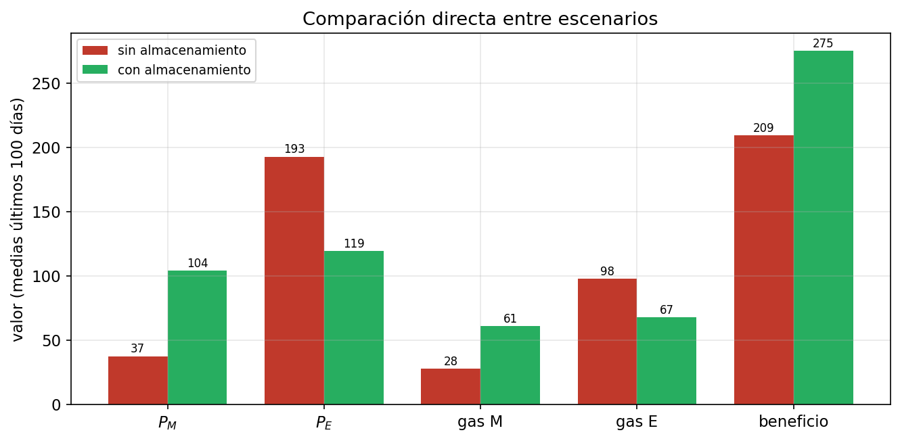

# Capítulo 5. Papel de las baterías

Los tres capítulos anteriores han construido, pieza a pieza, el instrumento que este capítulo pone a trabajar. El Capítulo 2 describió el mercado y dejó deliberadamente sin especificar la regla con que cada productor solar decide su fracción de almacenamiento; el Capítulo 3 resolvió esa decisión bajo racionalidad estratégica plena —el cártel, el Nash homogéneo y su límite competitivo—; y el Capítulo 4 mostró que una población de agentes con racionalidad acotada, dotados de la regla de aprendizaje adecuada, reproduce de forma emergente el equilibrio de Nash sin que nadie resuelva problema de optimización alguno. Con ese mecanismo ya validado, el presente capítulo abandona el plano metodológico y aborda la **pregunta económica** que motiva el trabajo: ¿qué efecto tiene el almacenamiento distribuido sobre los precios del mercado, sobre el uso de generación de respaldo y sobre el bienestar del sistema?

La estrategia es comparativa. Se contrastan dos escenarios que comparten todos los parámetros estructurales —demanda, tecnología solar, función de coste del gas y número de agentes— y difieren únicamente en un punto: la disponibilidad de almacenamiento. En el primero (sección 5.1), los productores carecen de baterías y venden toda su energía en el periodo en que la generan. En el segundo (sección 5.2), disponen de almacenamiento y aprenden a usarlo con la regla del Capítulo 4. La sección 5.3 cuantifica directamente las diferencias entre ambos, y la sección 5.4 las interpreta en clave de bienestar. Todas las simulaciones emplean la parametrización INTERIOR de las secciones 3.5 y 4.1.4 ($N = 30$ agentes, horizonte de $T = 500$ días, eficiencia $\eta = 0{,}9$), y las magnitudes que se reportan son medias del régimen estacionario, calculadas sobre los últimos cien días.[^repro]

## 5.1. Escenario base sin almacenamiento

El escenario base fija la fracción de almacenamiento en cero para todos los agentes y en todos los días ($f_i(t) = 0\ \,\forall i, t$). Toda la energía producida se vende de forma inmediata en su periodo, sin posibilidad de desplazamiento intertemporal: $q_i^M(t) = \tilde{q}_i^M$ y $q_i^E(t) = \tilde{q}_i^E$. El resto del modelo —demanda $D_M = 80$ y $D_E = 120$, estructura del mercado y tecnología de gas— es idéntico al del escenario con almacenamiento, lo que garantiza la comparabilidad. Este escenario no es un mero punto de partida técnico: representa el contrafactual relevante, el mercado eléctrico tal como se comportaría si los productores solares no tuvieran baterías.

El rasgo dominante de este escenario es una **fuerte asimetría temporal de precios**. La generación solar es abundante por la mañana y escasa por la tarde, mientras que la demanda es mayor en el periodo vespertino; el desajuste entre ambos perfiles determina los precios. Por la mañana, la oferta solar cubre buena parte de la demanda y el productor de gas apenas necesita entrar, de modo que el precio se mantiene bajo, en torno a $P_M \approx 37{,}3$. Por la tarde, en cambio, la solar es insuficiente y el gas debe cubrir un déficit considerable; como su coste marginal es convexo, el precio se dispara hasta $P_E \approx 192{,}7$, más de cinco veces el matutino. El ratio entre ambos precios, $P_M / P_E \approx 0{,}19$, es la medida más nítida de esta brecha: existe una enorme diferencia de valor entre la energía de la mañana y la de la tarde que ningún agente está aprovechando.

El reverso de esa asimetría de precios es el patrón de uso de gas. El gas matutino es modesto ($\bar{G}_M \approx 27{,}6$ unidades de media), porque la solar cubre la mayor parte de la demanda de la mañana; el gas vespertino, en cambio, es elevado ($\bar{G}_E \approx 97{,}5$), porque la energía solar producida por la mañana no puede contribuir a la demanda de la tarde y debe suplirse con generación térmica. La dependencia del respaldo fósil se concentra, así, justo en el periodo de mayor demanda y mayor coste marginal. Es precisamente esta configuración —energía barata y ociosa por la mañana, energía cara y escasa por la tarde— la que abre una oportunidad de arbitraje intertemporal que el almacenamiento permite explotar.

## 5.2. Escenario con almacenamiento bajo la regla elegida

En este escenario los productores disponen de baterías y deciden cada día qué fracción $f_i(t)$ de su producción matutina almacenan para venderla por la tarde, ajustando su estrategia mediante la regla de aprendizaje del Capítulo 4 (z-score del beneficio realizado, actualizando solo la fracción jugada, sin decaimiento). Se trata, literalmente, del mismo experimento de aprendizaje analizado en aquel capítulo, de modo que su convergencia no se vuelve a demostrar aquí: la fracción media se asienta sobre el equilibrio de Nash ($\bar{f} \to 0{,}633$, frente al $f^N = 0{,}639$ teórico), con la dispersión residual entre agentes que el Capítulo 4 documentó y explicó por la planitud del paisaje de beneficios. Lo que interesa ahora no es *que* el aprendizaje converja, sino *qué efectos económicos* produce esa fracción de equilibrio sobre el mercado, que es lo que el Capítulo 4 no examinó.

El primer efecto es sobre los precios. Al almacenar de media un 63 % de su producción matutina, los agentes retiran oferta solar de la mañana y la trasladan a la tarde. El precio matutino sube hasta $P_M \approx 104{,}0$ y el vespertino baja hasta $P_E \approx 119{,}4$: los dos precios, que en el escenario base distaban en un factor de cinco, **convergen** hasta quedar a una distancia escasa.

Esta convergencia tiene una lectura económica precisa, que enlaza con el análisis del Capítulo 3. La brecha de precios, medida por el ratio $P_M / P_E$, pasa de $0{,}19$ en el escenario base a $0{,}874$ con almacenamiento. El valor de llegada no es arbitrario: el umbral $\eta = 0{,}90$ es la condición de no-arbitraje del agente precio-aceptante (sección 3.3), y que el ratio se asiente algo por debajo —en el $0{,}880$ del Nash homogéneo— es la cuña de poder de mercado ya analizada allí: con $N$ finito, cada agente frena el arbitraje antes de $\eta$ para no devaluar el ingreso vespertino que ya percibe. El almacenamiento distribuido **casi cierra así la brecha de arbitraje ajustada por eficiencia**, reduciéndola drásticamente de $0{,}19$ a $0{,}87$. Que el ratio simulado reproduzca el del Nash teórico, y no el del precio-aceptante ($0{,}90$), es la confirmación, ahora en el plano de los precios, de lo que el Capítulo 4 mostró en el de las cantidades: el aprendizaje conduce al equilibrio estratégico.

El traslado de energía se refleja también, de forma simétrica, en el uso de gas. El respaldo vespertino se reduce ($\bar{G}_E \approx 67{,}5$, frente a las $97{,}5$ unidades del escenario base), porque la energía almacenada llega al periodo de mayor demanda; el matutino aumenta ($\bar{G}_M \approx 60{,}7$, frente a $27{,}6$), porque al retirar oferta solar de la mañana hay que cubrir esa demanda con gas. El almacenamiento no suprime la generación fósil: la **reordena** en el tiempo, un punto sobre el que la sección 5.4 vuelve con detalle.

## 5.3. Comparación directa: precios, gas, beneficios

La Tabla 5.1 reúne los principales indicadores de ambos escenarios, calculados como medias del régimen estacionario. La Figura 5.4 los representa en un gráfico de barras.

**Tabla 5.1** — Comparación de indicadores entre escenarios (medias de los últimos cien días)

| Indicador | Sin almacenamiento | Con almacenamiento | Variación |
|---|---:|---:|---:|
| Precio medio mañana ($\bar{P}_M$) | 37,32 | 104,01 | +178,7 % |
| Precio medio tarde ($\bar{P}_E$) | 192,71 | 119,40 | −38,0 % |
| Ratio $P_M / P_E$ | 0,194 | 0,874 | — |
| Gas medio mañana ($\bar{G}_M$) | 27,59 | 60,68 | +120,0 % |
| Gas medio tarde ($\bar{G}_E$) | 97,54 | 67,48 | −30,8 % |
| Gas total | 125,13 | 128,17 | **+2,4 %** |
| Beneficio medio por agente ($\bar{\pi}$) | 209,44 | 275,19 | +31,4 % |
| Fracción media de almacenamiento | 0,00 | 0,633 | — |
| Coste de gas acumulado | 4 306 703 | 3 137 667 | **−27,1 %** |

### Efecto sobre los precios

El almacenamiento produce, como se ha visto, una convergencia de precios: el matutino sube un 178,7 % y el vespertino baja un 38,0 %. Conviene notar que el efecto sobre el precio de la mañana es **proporcionalmente mucho mayor** que sobre el de la tarde, y la razón está en la convexidad de la función de coste del gas. Como $c_G(q) = c_0 + \alpha_G\, q^{\gamma_G}$ con $\gamma_G > 1$, el coste marginal crece más que proporcionalmente con la cantidad de gas. Por la mañana se parte de un nivel de gas bajo, donde el coste marginal es pequeño pero su pendiente, en términos relativos, pronunciada: añadir gas matutino encarece el precio con fuerza. Por la tarde se parte de un nivel alto, donde retirar gas alivia el precio de forma más moderada. La misma redistribución de gas tiene, por tanto, un impacto asimétrico sobre los dos precios, y esa asimetría es la que hace que el almacenamiento sea valioso para el sistema, como se argumenta en la sección 5.4.

Un efecto secundario merece mención por honestidad descriptiva. El almacenamiento **aumenta la volatilidad temporal de los precios** en ambos periodos: la desviación típica del precio matutino entre días pasa de $1{,}4$ a $5{,}4$, y la del vespertino de $0{,}9$ a $5{,}1$. La causa es que las decisiones de almacenamiento, estocásticas por la regla logit y nunca del todo fijas por la exploración residual del Capítulo 4, se transmiten día a día a la oferta efectiva de cada periodo y, a través de ella, a los precios. La flexibilidad intertemporal que aporta la batería, unida a la regla de aprendizaje estocástica empleada, tiene como contrapartida una mayor variabilidad diaria.

### Efecto sobre el uso de gas: redistribución, no reducción

El dato más importante de la Tabla 5.1, y el que más se presta a malentendido, es que el almacenamiento **no reduce el uso total de gas, sino que lo aumenta ligeramente** (+2,4 %). El resultado puede parecer paradójico —cabría esperar que más energía solar aprovechada significara menos gas—, pero se sigue de forma directa de la eficiencia de la batería. Como $\eta = 0{,}9 < 1$, cada unidad de energía que entra en el ciclo de almacenamiento pierde un 10 % por el camino: de cada unidad retirada de la mañana solo llegan $0{,}9$ a la tarde. El sistema, en conjunto, debe cubrir la misma demanda con una oferta solar efectiva algo menor, y esa diferencia la suple el gas. El almacenamiento, por su propia naturaleza física, introduce una pérdida agregada de energía que se traduce en un uso total de respaldo levemente superior.

Lo que el almacenamiento sí hace es **redistribuir** ese gas entre periodos: lo traslada de la tarde, donde se usaba mucho, a la mañana, donde se usaba poco. Que esta redistribución sea beneficiosa pese a aumentar el gas total no es evidente a priori y constituye el núcleo del análisis de bienestar de la sección siguiente.

### Efecto sobre los beneficios

El beneficio medio de los productores solares aumenta un 31,4 %, de $209{,}4$ sin almacenamiento a $275{,}2$ con él. Esta cifra de llegada no es casual: coincide con el beneficio por agente del equilibrio de Nash homogéneo calculado en el Capítulo 3 ($275{,}1$). El almacenamiento permite a cada productor capturar parte del valor que la brecha de precios dejaba sin explotar en el escenario base, y el aprendizaje conduce al conjunto justo hasta el pago que predice el equilibrio estratégico —ni el del cártel, que exigiría coordinarse para almacenar menos y sostener precios vespertinos más altos, ni el competitivo—. La mejora de beneficios es, pues, la manifestación monetaria del cierre del arbitraje analizado en la sección 5.2.

## 5.4. Análisis de bienestar

El análisis anterior ha mostrado que el almacenamiento beneficia a los productores y que no reduce —incluso aumenta— el uso total de gas. Cabe entonces preguntarse si el almacenamiento mejora el bienestar del sistema en su conjunto o si solo redistribuye valor hacia los productores a costa de un mayor consumo de respaldo. La respuesta exige mirar más allá de la cantidad de gas, al **coste** de generarlo.

El coste total de la generación de gas en un periodo es la integral de su coste marginal,

$$C_G(q) = \int_0^q c_G(x)\,dx = c_0\, q + \frac{\alpha_G}{1 + \gamma_G}\, q^{1 + \gamma_G},$$

una función convexa en $q$ (con $\gamma_G > 1$). Esta convexidad es la clave de todo el argumento. Cuando el coste es convexo, repartir una cantidad de producción entre dos periodos sale más barato que concentrarla en uno solo: el coste de las últimas unidades —las más caras— crece muy deprisa, de modo que igualar el gas entre la mañana y la tarde reduce el coste total aunque la cantidad agregada no cambie, o incluso aumente un poco. La Figura 5.6 lo hace visible. Sobre la curva de coste $C_G(q)$, el escenario base sitúa sus dos periodos en posiciones muy separadas —la mañana ($27{,}6$) en el tramo barato, la tarde ($97{,}5$) en el tramo caro—, mientras el escenario con almacenamiento los agrupa en torno al centro ($60{,}7$ y $67{,}5$). El coste medio por periodo es la altura del punto medio del segmento que une ambos puntos: por la convexidad, ese segmento queda por encima de la curva, y tanto más alto cuanto más separados estén sus extremos. El par disperso del escenario base eleva el coste medio muy por encima del par agrupado del escenario con almacenamiento, pese a que este último quema algo más de gas en total.

El resultado agregado es inequívoco: el coste de gas acumulado a lo largo de la simulación pasa de $4{,}31$ millones de unidades en el escenario base a $3{,}14$ millones con almacenamiento, una **reducción del 27,1 %** (de unas $8{,}6$ mil unidades de coste medio diario a $6{,}3$ mil). Es un resultado fuerte y, a primera vista, sorprendente: el sistema gasta un 2,4 % más de gas pero un 27 % menos en costearlo. La aparente paradoja se disuelve con lo anterior: lo que importa para el coste no es cuánto gas se quema en total, sino *cómo se reparte*, y el almacenamiento lo reparte de forma mucho más eficiente.

Conviene ser preciso sobre el significado de este resultado. El almacenamiento distribuido, tal como se modela aquí, **no es un mecanismo de reducción de la generación fósil**: el gas total sube. Su valor es de otra índole —es un mecanismo de *eficiencia en costes*—, que aprovecha la convexidad de la tecnología de respaldo para suavizar el perfil de generación. Su efecto sobre las emisiones, por tanto, no es directo: depende de si la métrica ambiental relevante es la cantidad de combustible quemado (que aumenta) o algún indicador asociado al coste o a los picos de generación (que mejora). Esta distinción, que el modelo permite trazar con nitidez, es una de las aportaciones del análisis.

### Reparto del bienestar entre los agentes

La reducción del coste de gas no es solo una métrica conveniente: es, hasta una constante, el **excedente total** del sistema. Como la demanda es rígida —los consumidores adquieren $D_M$ y $D_E$ con independencia del precio—, el valor bruto que obtienen de la electricidad es una constante, y el único coste de producción del sistema es el del gas: la generación solar no cuesta nada producirla —se vende al precio que fija el gas como tecnología marginal, pero ese ingreso es una transferencia, no un coste de recursos—. El excedente total es, por tanto, esa constante menos el coste de generación de gas, de modo que la caída del 27 % en dicho coste *es* la ganancia neta de eficiencia del sistema, no una mera aproximación a ella. Lo que el análisis de coste deja en penumbra es **cómo se reparte** esa ganancia, y la imagen resulta más rica de lo que la cifra agregada sugiere. La Tabla 5.2 descompone la variación del excedente entre los tres tipos de agente.

**Tabla 5.2** — Flujos monetarios por agente y variación del excedente (medias por día, régimen estacionario)

| Componente | Sin almac. | Con almac. | Δ excedente |
|---|---:|---:|---:|
| Consumidor (gasto en electricidad) | 26 111 | 22 649 | +3 461 |
| Productores solares (ingreso = excedente) | 6 283 | 8 256 | +1 972 |
| Productor de gas (renta inframarginal) | 11 207 | 8 136 | −3 071 |
| **Sistema (coste de generación de gas)** | **8 621** | **6 258** | **+2 362** |

En las filas del consumidor y del sistema, el flujo tabulado es lo que se *paga* o *cuesta*, de modo que su descenso es una ganancia de excedente (Δ positiva); en las de solar y gas, el flujo tabulado es ya el propio excedente. La columna Δ excedente recoge el reparto y suma al total: $3\,461 + 1\,972 - 3\,071 = 2\,362$.

El **consumidor gana**, y es el mayor beneficiario: su gasto cae un $13{,}3\,\%$, porque la bajada del precio vespertino, que se aplica sobre la demanda grande de la tarde ($D_E = 120$), supera con holgura la subida del precio matutino, que recae sobre la demanda menor de la mañana ($D_M = 80$). Con demanda rígida, esa reducción del gasto es exactamente su ganancia de excedente.[^csnivel] El **productor solar gana** también ($+31{,}4\,\%$), como ya mostró la sección 5.3: alcanza el pago de Nash. El que **pierde es el productor de gas**: sus rentas inframarginales —lo que cobra por encima de su coste, al fijarse el precio en su coste marginal creciente— se comprimen al estrecharse la brecha de precios entre periodos.

Las tres piezas encajan. La ganancia del consumidor y la del productor solar ($+3\,461$ y $+1\,972$) suman más que la ganancia de eficiencia del sistema ($+2\,362$), y la diferencia es precisamente lo que pierde el productor de gas ($-3\,071$): parte de lo que ganan consumidores y solares es eficiencia genuina creada por la redistribución, y parte es una transferencia desde las rentas del gas. El matiz corrige una lectura natural pero incompleta —que el carácter exógeno de la demanda dejaría a los consumidores «al margen»—: lejos de quedar al margen, son los principales beneficiarios del almacenamiento.[^arbitraje]

[^csnivel]: Con demanda perfectamente inelástica, el *nivel* del excedente del consumidor no está definido (equivaldría a una disposición a pagar infinita), pero su *variación* sí lo está y es igual, con signo opuesto, a la variación del gasto: al no cambiar la cantidad consumida, todo cambio de precio es una transferencia pura entre consumidores y productores. Es esa variación, no el nivel, la que se reporta.

[^arbitraje]: El patrón —desplazamientos de excedente entre consumidor y productores compensando la reducción del valor puro de arbitraje a medida que el almacenamiento desplaza carga— concuerda con lo que la literatura empírica documenta para un almacenamiento precio-aceptante que optimiza el arbitraje (Sioshansi et al., 2009). La diferencia es que aquí no lo produce un operador que optimiza, sino que emerge del aprendizaje descentralizado de los productores.

En conjunto, el balance de bienestar del almacenamiento distribuido es positivo: el sistema gana en eficiencia —un $27\,\%$ menos de coste de respaldo— y esa ganancia, sumada a una transferencia desde las rentas del productor de gas, se reparte entre consumidores (los mayores beneficiarios) y productores solares. El precio que el sistema paga por ello es una mayor volatilidad diaria de los precios y una leve pérdida física de energía por la ineficiencia de las baterías.

## 5.5. Síntesis, limitaciones y extensiones

Con este capítulo se cierra el cuerpo del trabajo. El recorrido ha ido de la estructura del mercado (Capítulo 2) a las soluciones que la racionalidad estratégica predice (Capítulo 3), de ahí al aprendizaje adaptativo que las reproduce de forma emergente (Capítulo 4) y, finalmente, a las consecuencias económicas de ese comportamiento (Capítulo 5). La conclusión de fondo es que el almacenamiento distribuido, gestionado por agentes que tan solo aprenden de su propia experiencia, conduce al mercado a un equilibrio en el que los precios se aproximan a su relación de no-arbitraje ajustada por eficiencia, los productores alcanzan el pago del equilibrio de Nash y el sistema reduce de forma notable el coste de la generación de respaldo al redistribuirla en el tiempo, en beneficio principalmente de los consumidores. Que todo ello emerja sin coordinación ni optimización explícita, del mero ajuste descentralizado de decisiones individuales, es el resultado central que el conjunto del trabajo ha tratado de establecer.

Estos resultados deben leerse a la luz de los supuestos del modelo, que es una representación estilizada, deliberadamente simple, orientada a aislar el mecanismo de arbitraje intertemporal. Cuatro de esos supuestos delimitan su alcance y, a la vez, señalan las extensiones más naturales. La **demanda es exógena y rígida**: no responde a los precios, de modo que el análisis no captura la respuesta de la demanda como fuente adicional de flexibilidad —una demanda elástica suavizaría por sí sola la brecha de precios y alteraría el reparto de excedentes que la sección 5.4 atribuye enteramente al lado de la oferta—. El modelo **no incorpora costes de almacenamiento** —degradación, mantenimiento, coste de capital de la batería—, que reducirían la rentabilidad del almacenamiento y, con ella, la fracción de equilibrio; introducirlos permitiría estudiar la decisión de inversión en capacidad, no solo la de uso. La generación de respaldo se reduce a **una única tecnología de gas**, cuando en los mercados reales coexisten varias con distintas estructuras de coste que enriquecerían la curva de oferta y el orden de mérito. Y los precios se forman en un **mercado sin restricciones de red**: incorporar congestión y localización abriría la cuestión de dónde conviene situar el almacenamiento. Ninguna de estas simplificaciones invalida los resultados —el cierre del arbitraje, la convergencia al pago de Nash y la ganancia de eficiencia en costes son robustos dentro del marco planteado—, pero cada una marca una dirección por la que el modelo, y el aprendizaje que lo gobierna, podrían extenderse en trabajo futuro.

[^repro]: Los dos escenarios, las figuras y las dos tablas de este capítulo se generan de forma autónoma con el script `generate_figures_cap5.py` (parametrización INTERIOR, regla elegida por defecto en `model.py`, semilla `seed=0` y horizonte de 500 días, idénticos a los del Capítulo 4 para que el escenario con almacenamiento coincida cifra a cifra). El ratio $P_M/P_E$ se computa como media de los cocientes diarios, en consonancia con el Capítulo 4. La descomposición de excedentes de la Tabla 5.2 (`table_5_2_bienestar.csv`) emplea la renta del productor de gas $c_G(q)\,q - C_G(q)$, promediando los componentes diarios sobre los últimos cien días; el script verifica que la suma de las variaciones de los tres excedentes iguala la ganancia de eficiencia. Todo el material es reproducible desde el repositorio público del proyecto.
